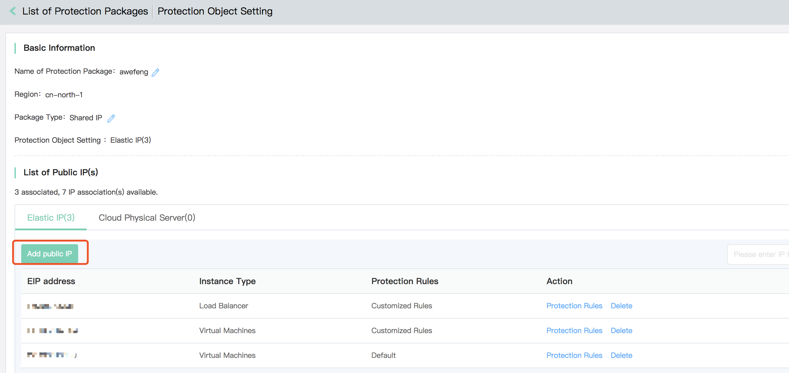
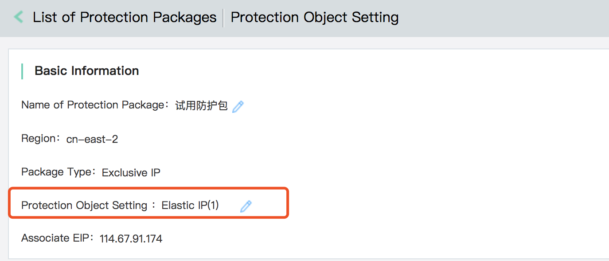

# Bind a Protection Object

Upon creation of instances, bind the object to be protected, and provide protection.

1. Find out the protection package to be protected, and click **protection object setting** in the action bar.

2. For example of shared IP, in the page of protection object setting, add Public IP to be protected.

Enjoy IP package alone, and add IP to be protected at the place of modifying the protection object.

## Related References
- [Create Instance](Create-Instance.md)

