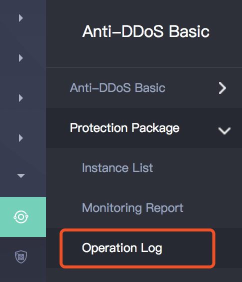
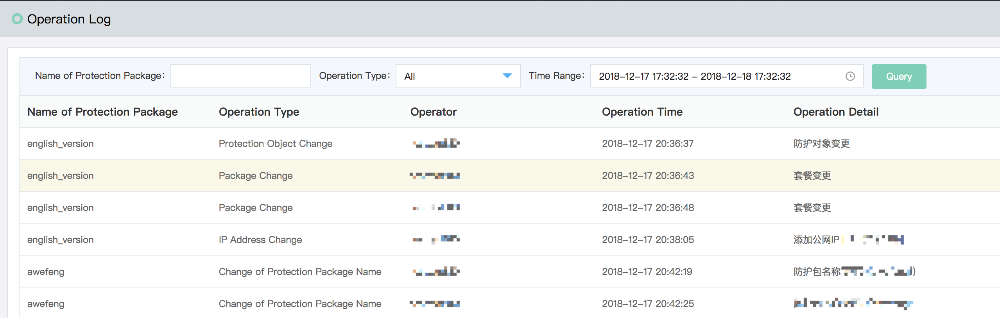

# View Operation Log

Anti-DDoS protection package operation log module records all user operations for log query within 3 months.

1. Log in the anti-DDoS basic console to find out the list of **Protection Packages --> Operation Logs**, namely enter the operation log query page. 

2. Support query for the operation type, including changes of package, protection object and protection rule. 

