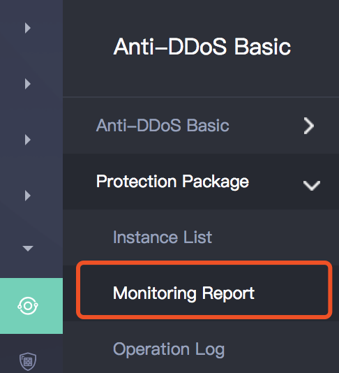
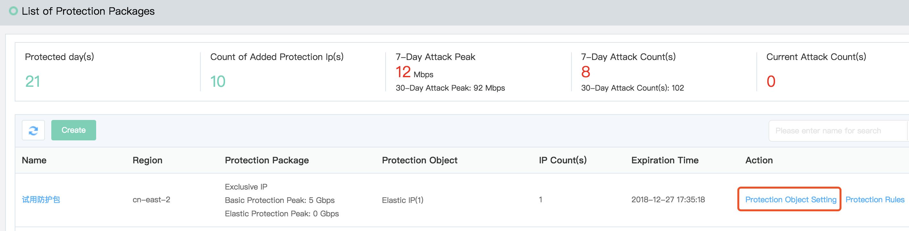
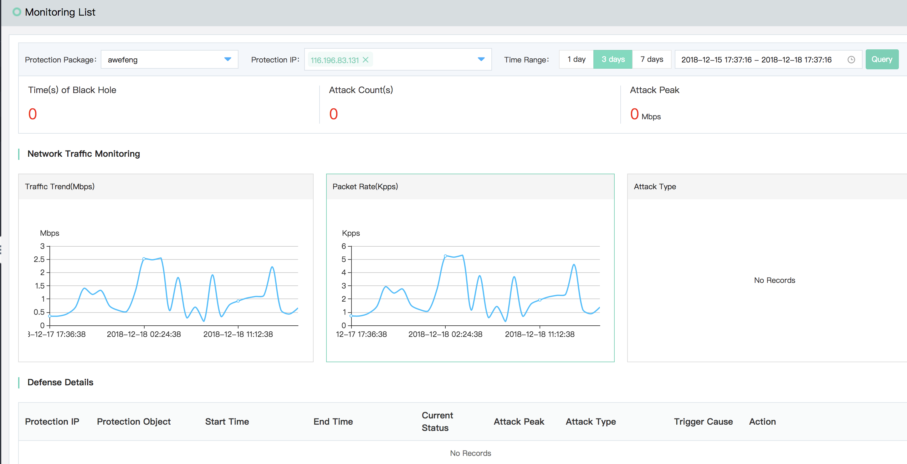

# View Security Reports
Anti-DDoS protection package provides abundant safe reports, helping you know the protection effect after purchasing.

## Action Steps
### Method 1
Log in anti-DDoS protection package [monitoring report](https://antiddos-console.jdcloud.com/gz/ddos/protection-monitor-list) page. The menu bar location is as follows:

The related report of the first protection package will be displayed by default.

### Method 2
1. Log in the Anti-DDoS protection package console, choose the protection package to be checked, and click **Protection Object Setting** in the action bar.**

2. Enter the protection object setting page, and click **Check Report** at the upper right part to check the report on the protection packages.

## Description for the report
The monitoring report of Anti-DDoS protection package is as follows:

It can be divided into three parts:

Part I shows the attack statistics within the selected time, including black hole counts, attack counts and attack peak value;

Part II shows the statistics about the network traffic monitoring and the attack types.

Part III shows the protection details.

- The report of the day can be displayed for 7 days or 30 days by default. The report within 90 days can be checked at most, and the minimum report granularity is 5min.
- All protection IPs are displayed by default after the certain protection package is selected. If there are many shared protection IPs, multiple choice is available. If multiple IPs are selected, data of graphs and charts in the report will be displayed accumulatively.

In the action bar for detailed protection, click **Attack Source** to check the condition of the attacker IP, with maximum display number of 1,000.

When there is an attack, the system will automatically capture the attack for post analysis and obtaining evidence

Click **Capture and Downloading** to download data package to the locality for detailed analysis. Start capturing for no more than 1,000 packages for longest 10 seconds when the system finds out the attack.

