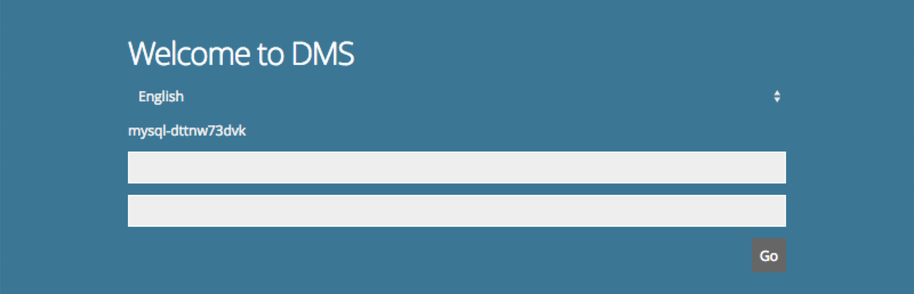
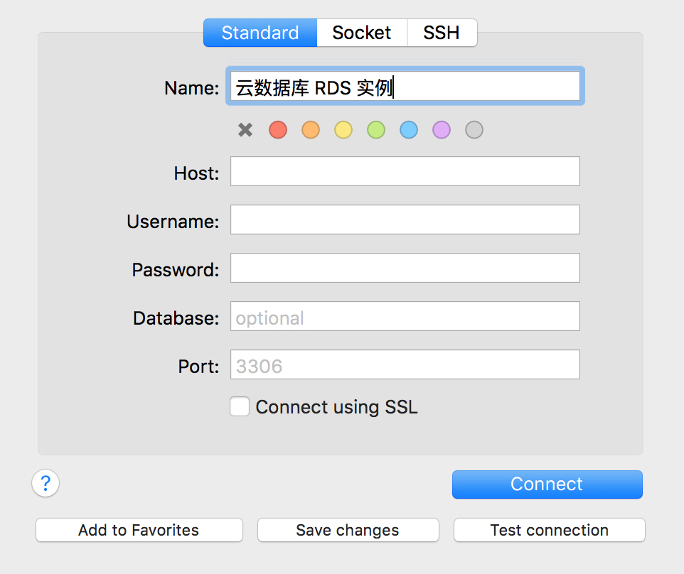

# Connection Instance
如果您购买了云数据库 MySQL/Percona/MariaDB 实例，可以通过京东云 DMS 功能连接实例， MySQL/Percona/MariaD/PostgreSQL实例均支持本地客户端通过外网访问域名远程连接实例，不过通过外网访问域名远程连接实例的时候，请提前做好访问权限控制，保证数据库的安全性。

## Connection Instances via DMS Function of Console
1. Login [RDS Console](https://rds-console.jdcloud.com/database).
2. Select the target instance to be connected and click ***Login Database*** in ***Operation*** column.
3. The login box interface of the DMS is as shown in the figure below, and the operating instructions of RDS connection is as follows.
    * Fill in the account number of RDS in the first row of textbox.
    * Fill in the correct password for RDS in the second row of textbox.
    * Click **Execute** to launch a request for RDS connection.
    

## Connection to Database via JD Cloud VM
Users can access the database by entering the command line after the RDS client is installed in JD Cloud Machine.

1. Command Format: mysql-h Domain Name -P Port -u Username -p Password.
2. Domain Name: The domain name of the cloud database to be accessed shall be displayed in the detail page of the cloud database.
3. Port: The default link port number is 3306, 其中PostgreSQL默认端口是5432.
4. Username: Username for database creation.
5. Password: Password of the username.

## Connection Instances via Local Database Management Software
If the local database management software is required to connect to the JCS for  MySQL/Percona/MariaDB/PostgreSQL service, the MySQL/Percona/MariaDB/PostgreSQL service does not support internet access in default. See the specific operation of manual open in [Open Internet Access](../../Operation-Guide/Instance/Internet-Access.md).
There are ways to access JCS for MySQL/Percona/MariaDB/PostgreSQL services, taking Sequel Pro software as an example.

### Operation Steps
1. Open the local database management software, and the specific parameters are as follows:
    * Host: Enter the full access domain name of JCS for MySQL/Percona/MariaDB/PostgreSQL services.
    * Username: Enter the account number of JCS for MySQL/Percona/MariaDB/PostgreSQL service.
    * Password: Enter the password for the account of JCS for MySQL/Percona/MariaDB/PostgreSQL service.
    * Port： MySQL/Percona/MariaDB默认就是 3306，其中PostgreSQL默认端口是5432，其他不需要做任何改动。

    

2. Click on the connect button to connect to the cloud database instance. 
