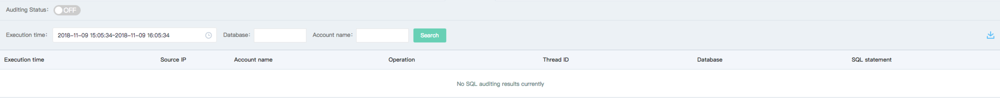

# JCS for MariaDB Audit Service
After enabling log audit for JCS for MariaDB, statistics for all DML and DDL operation information will be performed.
SQL audit will not parse the actual parameter values and a few records will be lost when SQL queries are relatively large. So, it may be inaccurate to count accurate incremental data in this way.

## Precautions
* SQL audit function is disabled by default, and is required to be enabled actively

## Action Steps
1. Login [Cloud Database RD Management Console](https://rds-console.jdcloud.com/database).  
2. Select the target instances need to query SQL audit. Click the target instance to enter Instance Details page, switch to ***SQL audit*** page, the SQL audit query functions is described as below.  
    * Execution time: You may choose to move up the time interval by one month from the current time as the SQL audit query time bucket.
    * Database: SQL statements that can view specified database.
    * Accounts: SQL statements that can view specified account.

    

3. Click ***Query*** to view satisfactory SQL list.
