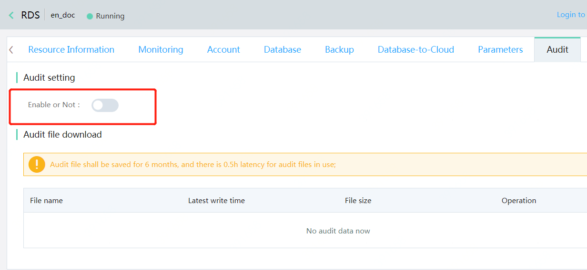

# Disable Audit

## 1. Operation Entrance
Enter the instance audit page and click the button on the right.
**Remark: If all audit strategies are deleted on the audit editing page, the audit will also be automatically disabled.**

## 2. Confirm to Disable
Click **OK** in the dialog to confirm
