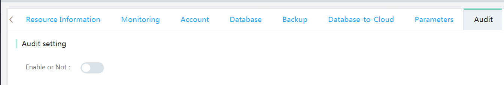
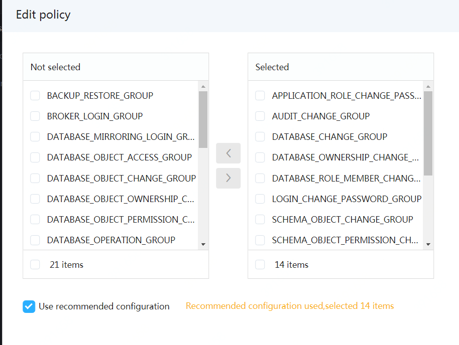

# Enable Audit
SQL Server audit is divided into the instance audit and the database audit.
- Instance audit: Audit operations such as enabling, disabling and editing can be made via the Console
- Database audit: As specific objects and SQL statements are involved, operations cannot be made via the Console. It needs to enable the instance audit first, connect to the specific database and execute SQL to enable, disable and edit audit.

## Enabling Instance Audit
1. Enter the detailed audit page of instance and click the enable/disable button on the right to enable the audit.



2. Enter the audit strategy editing page
- When the audit is enabled, the display will directly enter to the audit policy editing interface.
- By default, the recommended audit policy will be used and audit policies can be selected according to demands
- Select the audit strategy to be enabled and click ***OK***.


## Enabling Database Audit
> **Note: Audit will consume database resources. If the database operation is frequently audited, database performance may be affected. As suggested, this function shall be enabled for key tables and operations or enabled only at specific time period.**

1. To enable the database audit, please enable instance audit first and then select at least one audit policy.
2. Use the user account with rw (read and write) permissions and connect the database whose audit is enabled.
3. Execute corresponding SQL statement to enable database audit. For example, if select, insert and delete audit of USER1 is enabled for Table tb1, then audit of USER 2 shall be enabled for tab2
```SQL
CREATE DATABASE AUDIT SPECIFICATION [Audit Name] -- Define the audit rule alias at will
FOR SERVER AUDIT [RDSAudit]                      -- Fixed name: RDSAudit, cannot be modified
ADD (SELECT ON OBJECT::[DBO].[tb1] BY [USER1]),
ADD (INSERT ON OBJECT::[DBO].[tb1] BY [USER1]),
ADD (DELETE ON OBJECT::[DBO].[tb1] BY [USER1]),
ADD (SELECT ON OBJECT::[DBO].[tb2] BY [USER2]),
ADD (INSERT ON OBJECT::[DBO].[tb2] BY [USER2]),
ADD (DELETE ON OBJECT::[DBO].[tb2] BY [USER2])
WITH (STATE=ON)
```

For specific SQL syntaxes, please refer to the  Microsoft document [CREATE DATABASE AUDIT](https://docs.microsoft.com/zh-cn/sql/t-sql/statements/create-database-audit-specification-transact-sql?view=sql-server-2017)
