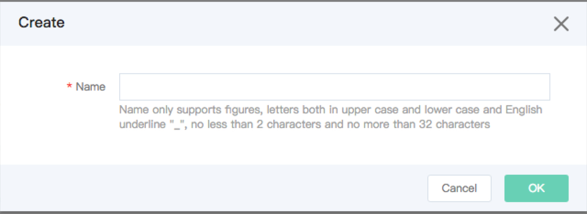

# Create backup for JCS for MariaDB
JCS for MariaDB instance supports automatic backup and manual backup; you may set the triggering time point for automatic backup by modifying backup policy. For specific operations, see [Backup Policy](./backup policy.md).
The backup of instance will be stored on cloud storage server of JD Cloud. At present, JD Cloud does not charge the space occupancy fee generated by backup.

## Precautions
* Manual backup: each region supports to create 5 backups at most. Manual backup will be automatically released as instances are deleted.
* If you need to test the modification for data of database instance, please perform manual backup for the instance in advance. After ensuring the test validation, the database of database instance may be restored to the original normal status.

## Create Manual Backup
1. Login [Cloud Database RDS console](https://rds-console.jdcloud.com/database).
2. Select the target instance that needs to be set as manual backup, click target instance name to enter Instance Details page.
3. Select ***Backup Management***, click***Create Backup***, Parameters of Create Backup pop-up box are described as below:
    * Backup name: duplication is allowed but the length and characters of the name have some limits which are subject to the console.
    * Click **OK** to complete backup operation.
    * Click **Cancel** to abandon backup operation.

    

4. Click **OK** to return Backup Policy Details page.
