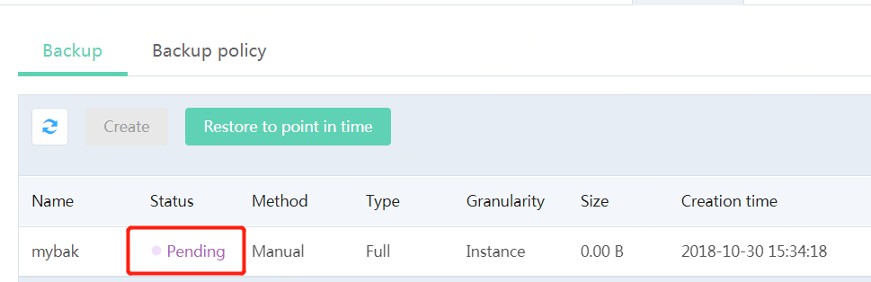

# Create Backup
JCS for SQL Server instances support two backup methods, i.e. automatic backup and manual backup,
- Automatic backup: Time point triggering automatic backup can be set by modifying backup policy. For specific operation, please refer to [Backup Policy](../Backup-Policy/SQLServer-Backup-Policy.md). The instance backup will be stored on the Cloud Storage Service of JD Cloud and the automatic backup is saved for 7 days by default.
- Manual backup: Users can initialize backup via the Console or OpenAPI. The system will not delete any backup manually initialized by users

##  Operation Steps
1. Click the instance name to enter Instance page, select **Backup Management** Page, click **Create Backup** and enter backup name
2. Select backup granularity
- Instance backup: It means that the entire instance is backed up. Select and click **OK** to start backup.
- Multi-database backup: It means that one or more databases will be backed up. The Console will list the currently-available databases (only the "Running" databases will be displayed in the list), please select the databases to be backed up and click **OK** to start backup.

3. Return to the backup list page, you will see the display that the backup is "Creating". Wait for a time period, click **Refresh** and manually refresh the page. You will see that the backup is completed and it is displayed that the backup is "Normal"

