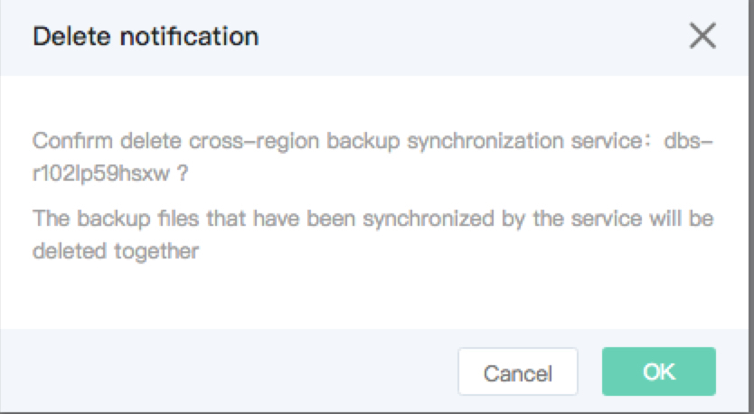

# Delete Cross-Region Backup Synchronization Service
The cross-region backup services can be manually deleted according to the service change.

## Precautions
* Delete backup service, and backup files will be deleted synchronously.

## Operation Steps
1. Login [Cross-region Backup Service Management Console](https://rds-console.jdcloud.com/acrossRegionList).
2. Select the backup service to be deleted, and click ***Delete*** in ***Operation*** on the service list page.
3. Popup box for deletion confirmation is shown in the figure.
    * Click ***OK*** to delete the backup service.
    * Click ***Cancel*** to cancel the deletion of backup service.

    
