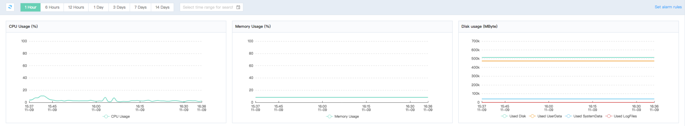

# View monitoring information
Multiple RDS service instance indexes can be viewed on the console. Through the index data, users can locate the system problems and perform corresponding system optimization.

## Operation Steps
1. Login [RDS Management Console](https://rds-console.jdcloud.com/database).
2. Select the instance that requires to view monitoring information, click the target instance, and enter the instance detailed page.
3. Select the tag of ***Monitor*** to view the cloud database monitoring items as shown below.
    
4. The monitoring data in the dimension of 1 hour is displayed by default. There are more dimensions available, including 6 hours, 12 hours, 1 day, 3 days, 7 days and 14 days. Users can select in the date range if to view the monitoring data within 30 days.

## MySQL Monitoring Items
|Monitoring Item|Description|Monitoring Frequency|Monitoring Period|
|---|---|---|--|
|CPU Utilization|CPU Usage Rate of Instances|60 sec/time|30 Days|
|Memory Usage Rate|Instance Memory Usage Rate|60 sec/time|30 Days|
|Hard disk usage | The amount of disk space used by the instance, including total disk space usage, user data usage, system data usage, and log file usage. Unit: MByte|60 seconds/time|30 days|
|Incoming Network Traffic|Unit: Kbps|60 sec/Time|30 Days|
|Outgoing Network Traffic|Unit: Kbps|60 sec/Time|30 Days|
|Network Traffic|Incoming and Outgoing Traffic of Instances per Second. Unit: Kbps|60 sec/time|30 Days|
|SQL Statement Executions per Second| Instances per Second SQL Statement Executions|60 sec/ time|30 Days|
|Transactions per Second|Instances per Second Transactions|60 sec/time|30 Days|
|Qty. of Temporary Table|Qty. of Temporary Tables Automatically Created on the Hard Disk during Database Execution of SQL Statements|60 sec/time| 30 Days|
|Current Connections|Active Connections and Total Connections of Instance|60 sec/time|30 Days|
|InnoDB Read/Write Volume|InnoDB Read and Written Amount of Data per Second|60 sec/time|30 Days|
|InnoDB Read Hit Ratio, Usage Rate, Dirty Block Rate of Cache Pool|InnoDB Read Hit Ratio and Utilization of Cache Pool and Percentage of Buffer Pool Dirty Blocks| 60 sec/time|30 Days|
|InnoDB Buffer Reads|InnoDB Reads and Writes to the Buffer Pool per Second |60 sec/time|30 Days|
|InnoDB Log Read and Write, fsync|InnoDB Number of Physical Writes per Second to Log Files, Log Write Request, Number of fsync Writes to Log Files |60 sec/time|30 Days|
|COMDML|Database SQL Statement Executions per Second, including Insert, Delete, Insert_Select, Replace, Replace_Select, Select and Update|60 sec/time|30 Days|
|IOPS|IO count of an instance per second, unit: times/second|60 seconds/time|30 days|
|Table Lock Times|Request Times of Immediate Obtaining Table Lock Request Since Running an Instance to Now|60 Seconds/Time|30 Days|
|Table Lock Waiting Times|Times of Failing to Obtaining Table Lock Requests Since Running an Instance to Now|60 Seconds/Time|30 Days|
|Row Lock Waiting Times of InnoDB|Row Lock Waiting Times of InnoDB Table Operation Since Running an Instance to Now|60 Seconds/Time|30 Days|
|Average Row Lock Obtaining Time by InnoDB|Average Time of Obtaining InnoDB Table Row Lock Since Running an Instance to Now|60 Seconds/Time|30 Days|

## Percona Monitoring Items
|Monitoring Item|Description|Monitoring Frequency|Monitoring Period|
|---|---|---|--|
|CPU Utilization|CPU Usage Rate of Instances|60 sec/time|30 Days|
|Memory Usage Rate|Instance Memory Usage Rate|60 sec/time|30 Days|
|Disk Usage|The amount of disk space used by the instance, including total hard disk space usage, user data usage, system data usage, and log file usage. Unit: MByte|60 seconds/time|30 days|
|Incoming Network Traffic|Unit: Kbps|60 sec/Time|30 Days|
|Outgoing Network Traffic|Unit: Kbps|60 sec/Time|30 Days|
|Network Traffic|Incoming and Outgoing Traffic of Instances per Second. Unit: Kbps|60 sec/time|30 Days|
|SQL Statement Executions per Second| Instances per Second SQL Statement Executions|60 sec/ time|30 Days|
|Transactions per Second|Instances per Second Transactions|60 sec/time|30 Days|
|Qty. of Temporary Table|Qty. of Temporary Tables Automatically Created on the Hard Disk during Database Execution of SQL Statements|60 sec/time| 30 Days|
|Current Connections|Active Connections and Total Connections of Instance|60 sec/time|30 Days|
|InnoDB Read/Write Volume|InnoDB Read and Written Amount of Data per Second|60 sec/time|30 Days|
|InnoDB Read Hit Ratio, Usage Rate, Dirty Block Rate of Cache Pool|InnoDB Read Hit Ratio and Utilization of Cache Pool and Percentage of Buffer Pool Dirty Blocks| 60 sec/time|30 Days|
|InnoDB Buffer Reads|InnoDB Reads and Writes to the Buffer Pool per Second |60 sec/time|30 Days|
|InnoDB Log Read and Write, fsync|InnoDB Number of Physical Writes per Second to Log Files, Log Write Request, Number of fsync Writes to Log Files |60 sec/time|30 Days|
|COMDML|Database SQL Statement Executions per Second, including Insert, Delete, Insert_Select, Replace, Replace_Select, Select and Update|60 sec/time|30 Days|
|IOPS|IO count of an instance per second, unit: times/second|60 seconds/time|30 days|
|Table Lock Times|Request Times of Immediate Obtaining Table Lock Request Since Running an Instance to Now|60 Seconds/Time|30 Days|
|Table Lock Waiting Times|Times of Failing to Obtaining Table Lock Requests Since Running an Instance to Now|60 Seconds/Time|30 Days|
|Row Lock Waiting Times of InnoDB|Row Lock Waiting Times of InnoDB Table Operation Since Running an Instance to Now|60 Seconds/Time|30 Days|
|Average Row Lock Obtaining Time by InnoDB|Average Time of Obtaining InnoDB Table Row Lock Since Running an Instance to Now|60 Seconds/Time|30 Days|

## MariaDB Monitoring Items
|Monitoring Item|Description|Monitoring Frequency|Monitoring Period|
|---|---|---|--|
|CPU Utilization|CPU Usage Rate of Instances|60 sec/time|30 Days|
|Memory Usage Rate|Instance Memory Usage Rate|60 sec/time|30 Days|
|Disk Usage|The amount of disk space used by the instance, including total hard disk space usage, user data usage, system data usage, and log file usage. Unit: MByte|60 seconds/time|30 days|
|Incoming Network Traffic|Unit: Kbps|60 sec/Time|30 Days|
|Outgoing Network Traffic|Unit: Kbps|60 sec/Time|30 Days|
|Network Traffic|Incoming and Outgoing Traffic of Instances per Second. Unit: Kbps|60 sec/time|30 Days|
|SQL Statement Executions per Second| Instances per Second SQL Statement Executions|60 sec/ time|30 Days|
|Transactions per Second|Instances per Second Transactions|60 sec/time|30 Days|
|Qty. of Temporary Table|Qty. of Temporary Tables Automatically Created on the Hard Disk during Database Execution of SQL Statements|60 sec/time| 30 Days|
|Current Connections|Active Connections and Total Connections of Instance|60 sec/time|30 Days|
|InnoDB Read/Write Volume|InnoDB Read and Written Amount of Data per Second|60 sec/time|30 Days|
|InnoDB Read Hit Ratio, Usage Rate, Dirty Block Rate of Cache Pool|InnoDB Read Hit Ratio and Utilization of Cache Pool and Percentage of Buffer Pool Dirty Blocks| 60 sec/time|30 Days|
|InnoDB Buffer Reads|InnoDB Reads and Writes to the Buffer Pool per Second |60 sec/time|30 Days|
|InnoDB Log Read and Write, fsync|InnoDB Number of Physical Writes per Second to Log Files, Log Write Request, Number of fsync Writes to Log Files |60 sec/time|30 Days|
|COMDML|Database SQL Statement Executions per Second, including Insert, Delete, Insert_Select, Replace, Replace_Select, Select and Update|60 sec/time|30 Days|
|IOPS|IO count of an instance per second, unit: times/second|60 seconds/time|30 days|
|Table Lock Times|Request Times of Immediate Obtaining Table Lock Request Since Running an Instance to Now|60 Seconds/Time|30 Days|
|Table Lock Waiting Times|Times of Failing to Obtaining Table Lock Requests Since Running an Instance to Now|60 Seconds/Time|30 Days|
|Row Lock Waiting Times of InnoDB|Row Lock Waiting Times of InnoDB Table Operation Since Running an Instance to Now|60 Seconds/Time|30 Days|
|Average Row Lock Obtaining Time by InnoDB|Average Time of Obtaining InnoDB Table Row Lock Since Running an Instance to Now|60 Seconds/Time|30 Days|

## SQL Server Monitoring Items
|  Monitoring Item  |  Description  |  Monitoring Frequency  |  Monitoring Period  |
|   --- |   --- |   --- |   --  |
|  CPU Usage Rate  |  CPU Usage Rate of Instances  |60 sec/time  |  30 Days  |
|  Memory Usage Rate  |  Instance Memory Usage Rate  |  60 sec/time  |  30 Days  |
|  Cache Hit Ratio  |  Cache Hit Ratio  |  60 sec/ time  |  30 Days  |
|  Total Connections  |  Total Connections for Current Instance  | 60 sec/time  | 30 Days  |
|  Number of Blocking Processes  |  Number of Blocked Processes  |  60 sec/time  | 30 Days  |
|  Used Space  |  Data Disk Used Space  |  60 sec/time  |  30 Days  |
|  Space Usage Rate |  Data Disk Usage Rate  |  60 sec/time  |  30 Days  |
|  Disk Queue Length  |  Disk IO Queue Length  |  60 sec/time  |  30 Days  |
|  Data Disk Read IO  |  Data Disk Reads IO Times per Second  |  60 sec/time  |  30 Days  |
|  Data Disk Write IO  |  Data Disk Writes IO Times per Second  |  60 sec/time  |  30 Days  |
|  Network Inflows per Second  |  Amount of Data Received per Second by Instance, in kbps  |  60 sec/time  |  30 Days  |
|  Network Outflows per Second  |  Amount of Data Sent per Second by Instance, in kbps  |  60 sec/time  |  30 Days  |
|  Transactions per Second  |  Instances per Second Transactions  |  60 sec/time  |  30 Days  |
|  Full Table Scans per Second  |  Average Full Table Scans per Second  |  60 sec/time  |  30 Days  |
|  Checkpoint Writes to Pages per Second  |  Checkpoint Writes to Pages per Second  |  60 sec/time  |  30 Days  |
|  Logins per Second  |  Logins per Second  |  60 sec/time  |  30 Days  |
|  SQL Compilation per Second  |  SQL Compilation per Second  |  60 sec/time  |  30 Days  |
|  Lock Timeouts per Second  |  Lock Timeouts per Second  |  60 sec/time  |  30 Days  |
|  Deadlocks per Second  |  Deadlocks per Second  |  60 sec/time  |  30 Days  |
|  Lock Waits per Second  |  Lock Waits per Second  |  60 sec/time  |  30 Days  |

## PostgreSQL Monitoring Items
|Monitoring Items|Description|Monitoring Frequency|Monitoring Period||
|---|---|---|--|
|CPU Utilization Rate|CPU Utilization Rate of Instance|60 Seconds/Time|30 Days|
|Memory Utilization Rate|Memory Utilization Rate of Instance|60 Seconds/Time|30 Days|
|Hard Disk Usage|The disk space usage of instance, including total disk space usage, user data usage, log file usage and system data usage. Unit: MByte|60 seconds/time|30 days|
|IOPS|IO count of an instance per second, unit: times/second|60 seconds/time|30 days|
|Network Traffic|Incoming traffic and sending traffic of instance per second. Unit: Kbps|60 seconds/time|30 days|
|Current Connection Number|Active and Total Connection Numbers of Instance|60 Seconds/Time|30 Days|
|Data Request|Scan and return row numbers of instance|60 seconds/time|30 days|
|Table Level Lock|Information about table lock of instance|60 seconds/time|30 days|
|Total count of reading and writing (adding, deleting, modifying and checking) requests per minute | Total count of reading and writing, reading and writing requests sent by instance per minute | 60 seconds/request | 30 days|
|Dilation Point | The time point at which instances reclaim useless cache | 60 seconds/request | 30 days|
|Average execution time of SQL request | Average execution time of all AQL request (excluding SQL in transaction) and average value of the TOP 10 SQL with the longest and shortest execution time | 60 seconds/request | 30 days|
|Latency synchronization between the primary database and the standby database | Synchronized delay between the primary repository and standby repository of instances | 60 seconds/request | 30 days|
|Read-only latency synchronization | Synchronized delay between the main instances and the standby instances | 60 seconds/request | 30 days|

