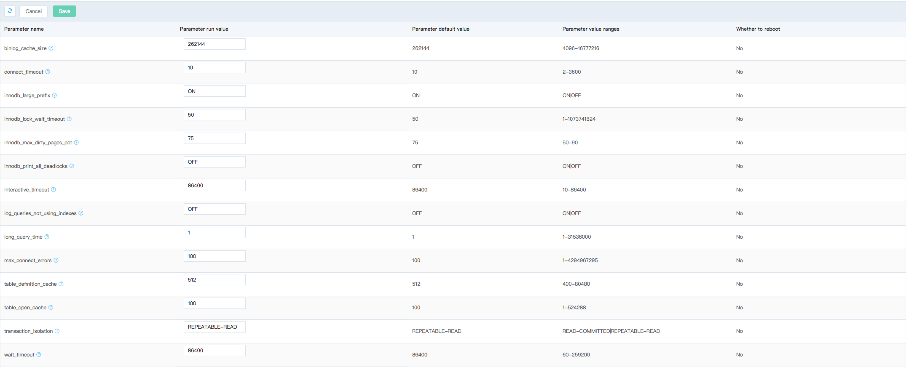

# Modify Parameter
The default value of all the parameters in the parameter list is the optimized value by JD Cloud. The parameter running value and the default value in the parameter list of the new parameter set are consistent. The default running value can meet the needs of most application scenarios. Users can modify the parameter running value as required according to their own service scenarios.

## Precautions

* Modify parameter set only under running instance

## Operation Steps
1. Login [Parameter Set Console](https://rds-console.jdcloud.com/paramgroup/list)
2. Select the target instance requiring parameter set modification, click the target instance, enter the page of instance details, and click Action =》 Modify Parameter Set on the top right corner of the page
3. Parameters are described in the pop-up box as follows:
    * Parameter set: List only the parameter set that matches the database type and version of the current instance
    * Click ***OK*** to finish parameter set modification
    * Click ***Cancel*** to give up parameter set modification

    
    
6. Click ***OK*** to complete the modification of the parameters and return to the parameter list page after confirmation.
7. Select the Tab page of ***Cloud Database***, and it can be seen that the values in the column of ***Parameter Set in Effect*** is changed from ***In Effect*** to ***Synchronizing***, indicating the modified parameters just made are synchronized to the database instance; if the status is changed from ***Synchronizing*** to ***In Effect***, it indicates that the modified parameters have been applied to the database instance.
