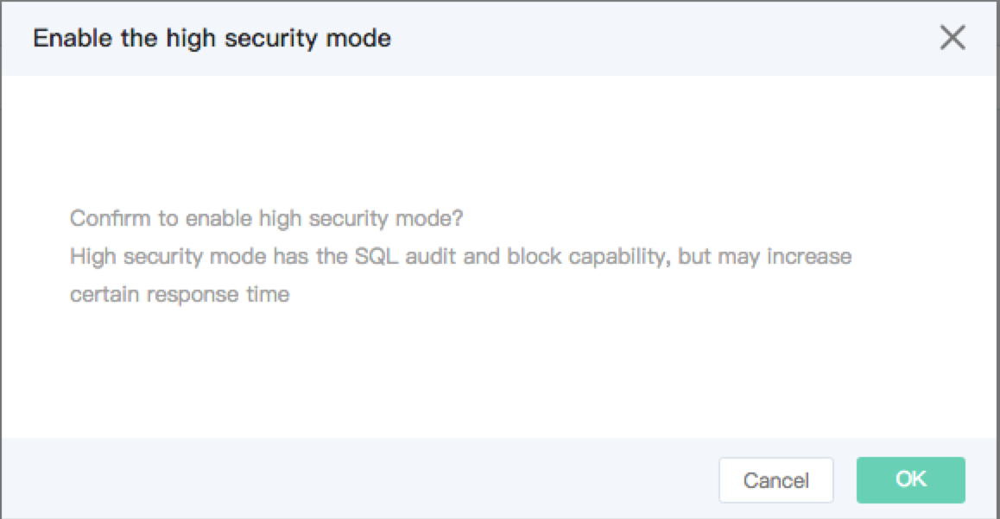

# Set Access Mode
The JCS for MySQL/Percona/MariaDB service support both standard mode and high security mode. The default mode is standard mode. Users can choose whether to enable high security mode according to service conditions.

* Standard Mode: Short response time, without capabilities of JCS for SQL audit and interception.
* High Security Mode: It has certain JCS for SQL interception ability (by analyzing eternal expressions, key system functions, etc. to achieve defense against JCS for SQL injection attacks), and can enable JCS for SQL audit, but it will increase the response time.

## Precautions
* The database service may be flashed when access modes are switched. Please reduce the operation during the low peak or make sure your application has an automatic reconnection mechanism to avoid flashing affecting the services.

## Operation Steps
1. Login [RDS Management Console](https://rds-console.jdcloud.com/database).
2. Select the target instance requiring to change the access mode, click the target instance, enter the instance detailed page, click on the upper right corner to ***Enable High Security Mode*** (or disable the high security mode), the pop-up window is as shown below.
    * Click ***OK*** to confirm that high security mode is enabled.
    * Click ***Cancel*** to enable the high security mode.

    
