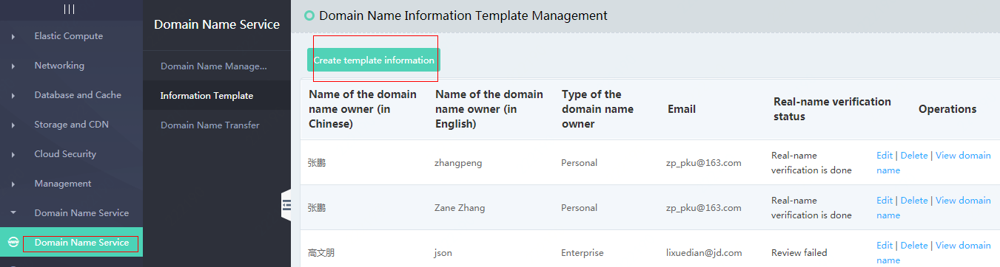
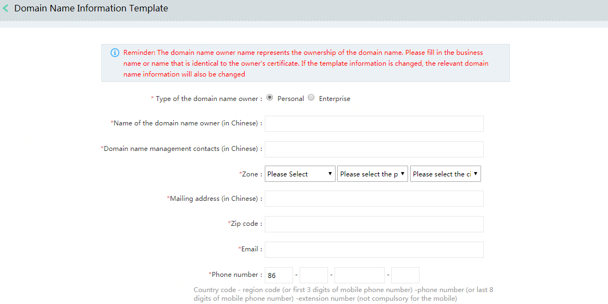
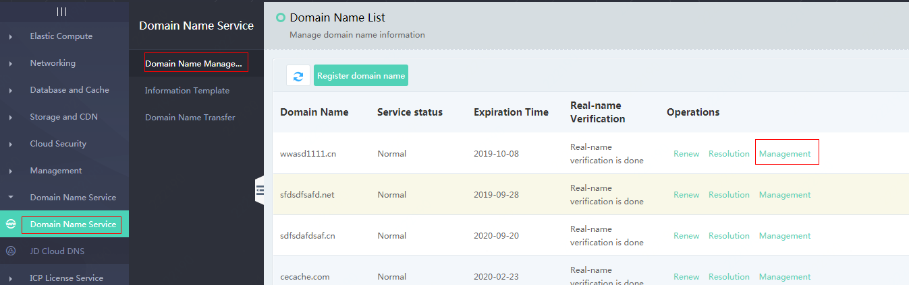
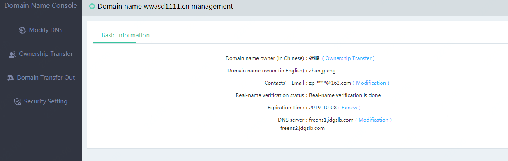
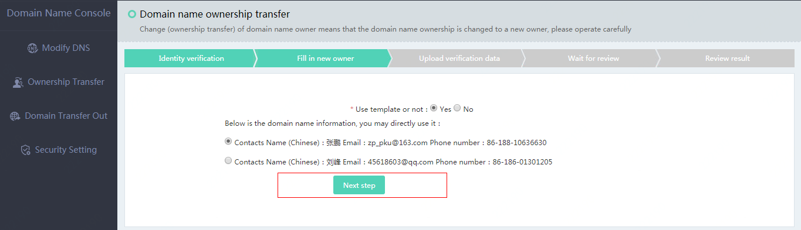

# Ownership Transfer of Domain Name

1. What is the ownership transfer of domain name?

The ownership transfer of domain name (change of registrant) means that the current registrant of the domain name is transferred to another individual or group, that is, the ownership of the domain name is transferred.

2. Ownership transfer process of domain name

Step 1: Create a template

Login to JD Cloud Member Account - Domain Name Service - Information Template

Fill in the new template information:

Step 2: Choose a domain name for transfer

Domain Name Service - Domain Name Management - Management

After selecting, click **Manage** to enter the page and select **Ownership Transfer**

Click **Use Template**, select the template you want to transfer and click **Next**

 
Upload certification data-wait for review, review time (within 2-3 working days)

 
After the approval is passed, the ownership transfer operation is completed.

