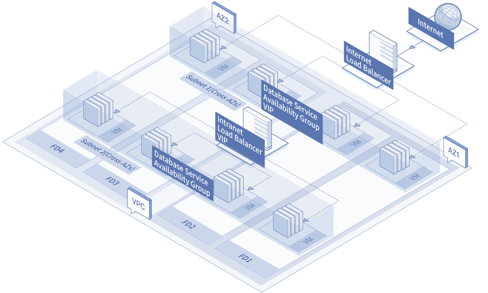

# Recommended Configuration

*  Different services shall be allocated with independent Availability Groups. If there are  instances of different function applied in the same Availability Group, one occurrence of fault may influence all the instances of the same function and thus leads to the failure of the whole service.
* The Availability Group is configured with multiple Availability Zones to cope with data center level fault.
* Create instances in an Availability Group (no less than two instances), so as to avoid single point service failure.
* Attach the Availability Group to load balancer to serve as backend service group for service load balance.
* Enable the auto-scaling (optional) to cope with load fluctuation.

The following figure shows an example of high availability of Web service. The Availability Group of Web service and Database are different and two Availability Zones are already configured into the two Availability Groups. Multiple instances have been deployed in each Availability Group and the Availability Groups are all attached to the responding load balancers. Instances in the Availability Group of Web service will receive service traffic from the Internet Load Balancer. The fault in one FD will only influence instances of the affected FD and will not influence Web instances and database instances in other FDs.

	The figure only gives an example of 2 FDs in each Availability Zone of a Availability Group. There are actually 5 FDs in each Availability Zone.

