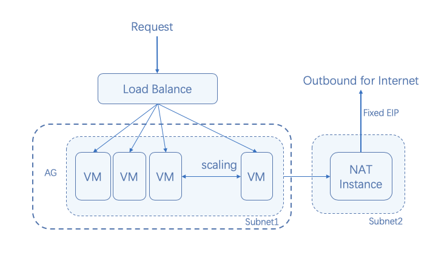

# Set the IPs of fixed exits

If you have these three demands for the Virtual Machines in Availability Group:

* Receive requests from Load Balancer
* The Virtual Machines in Availability Group needs to actively access the public network
* A fixed public IP is expected to be used when the public network is accessed

## Operation Steps

**Step 1: Create the Virtual Private Cloud and two subnets: Subnet 1 and Subnet 2. One of the subnets contains Availability Group, and the other contains the NAT instance.**

1. Access the [Virtual Private Cloud Console](https://cns-console.jdcloud.com/vpc/list) to log in the VPC list page. Or access [JD Cloud Console](https://console.jdcloud.com) click the left navigation bar **Network** - **Virtual Private Cloud** to log in the VPC list page.
2. Select regions.
3. Click **Create** button.
4. Set the name and description of Virtual Private Cloud in the popped-up Create virtual private cloud popup.
	
	Set the name of this step as: "Web service".
5. Set the CIDR of Virtual Private Cloud: Set the boundary of the Virtual Private Cloud. CIDR can only be an intranet segment, and the optional scope is 10.0.0.0 (mask 16 ~ 28), 172.16.0.0 ~ 172.31.0.0 (mask 16 ~ 28), 192.168.0.0 (mask 16 ~ 28). CIDR presetting can be ignored. In this case, the boundary of vpc will automatically scale with the subnet segment therein. The user having deeply understood the network is suggested to select the Virtual Private Cloud without preset CIDR.

	In this step, CIDR is set as the Virtual Private Cloud of 192.168.0.0/16, and is named as.

6. Click **OK** to view the Virtual Private Cloud created.
7. Access [Subnet Console](https://cns-console.jdcloud.com/subnet/list) to log in the subnet list page. Or access [JD Cloud Console](https://console.jdcloud.com) click the left navigation bar **Network** - **Virtual Private Cloud** - **Subnet** to log in the VPC list page.
8. Select the region of the Virtual Private Cloud created just now, and click **Create**, so the Create Subnet popup pops up.
9. Select the "Web service" of the corresponding Virtual Private Cloud; the CIDR of a subnet can only be an intranet segment, and the optional scope is within the CIDR scope of "Web service". Here, 192.168.1.0/24 and 192.168.2.0/24 are assigned to subnets 1 and 2 respectively.
10. Set the name and description of the subnet.
11. Select the route table associated with subnets, each subnet can and must associate a route table. Please note that a separate route table, such as "Availability Group Route Table" is configured for subnet 1 with public network access requirement.
12. Click **OK** to trigger subnet creation.

**Step 2: Create the NAT instance in Subnet 2, and assign the elastic IP for the instance. The IP is the fixed IP address for the Virtual Machines in Availability Group to access the public network.**

Refer to [Create Linux instances](../../Virtual-Machines/Getting-Start-Linux/Create-Linux-Instance.md) for the detailed steps for creating NAT instances. It is only required to select the CentOS 7.2 64-bit NAT Gateway in public images.

**Step 3: Configure the Virtual Private Cloud route table to guide the public network flow of Subnet 1 to the NAT instance.**

1. Access the [route table Console](https://cns-console.jdcloud.com/routeTable/list) to log in the route table list page. Or access the [JD Cloud Console](https://console.jdcloud.com), click the left navigation bar **Network** - **Virtual Private Cloud** - **Route Table** to log in the route table list page.
2. Find the "Availability Group Route Table", click the name to log in the details;
3. Click **Route Policy** tag to view the information on the route policy tab, and click **Edit**.
4. To add a route policy, the target end is the address of the public network or 0.0.0.0/0. The next-hop type is Virtual Machines, and the instance created by NAT Gateway image shall be passed before the next-hop is selected.
5. Click **Save**.

**Step 4: Availability Group is created based on Subnet 1, and new instances shall be added to Availability Group.**

Now you need to create Availability Group for your business. Refer to [Quick Start for Availability Group](../Getting-Start.md) for the detailed steps.

	Please note that the Virtual Private Cloud of Availability Group shall be the same as that of the NAT instance, but the subnet shall be different.
	
So, the Virtual Machines in Availability Group can access the public network through the elastic IP configured by the NAT instance.

## Related References

[Create Linux instance](../../Virtual-Machines/Getting-Start-Linux/Create-Linux-Instance.md)
