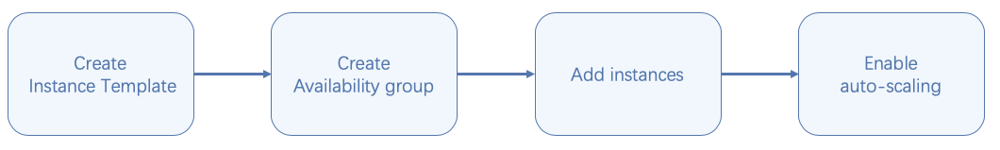
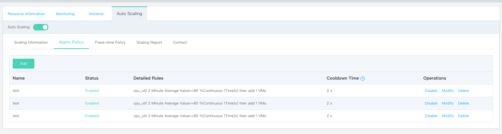
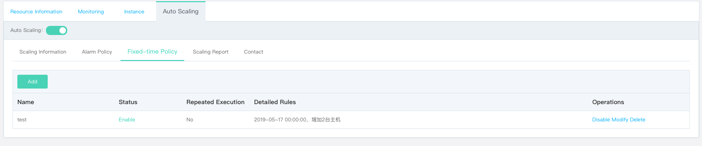

# Getting Started

There are four steps to deploy availability service via JD Cloud:

## Step 1: Create Instance Template

Instance template defines the configuration information of instances in Availability Group, including the information of image, instance type, system disk and data disk type and capacity, VPC/subnet configuration, security group and log-in information etc.

### Preconditions:

* You can in advance [Create VPC ](../../Networking/Virtual-Private-Cloud/Operation-Guide/VPC-Configuration.md) and [Create Subnet](../../Networking/Virtual-Private-Cloud/Operation-Guide/Subnet-Configuration.md) or create VPC and subnet together with the Virtual Machines.
* If you need a SSH key pair to login an Linux instance, you can in advance the [ Create SSH Key Pair](../Virtual-Machines/Operation-Guide/Key-Pair/Create-Keypair.md) or create key pair together with instances.
* If you need a security group to mange the access secutity of instances, you can in advance [Create Security Group](../../Networking/Virtual-Private-Cloud/Operation-Guide/Security-Group-Configuration.md) and [Configure Security Group](../../Networking/Virtual-Private-Cloud/Operation-Guide/Security-Group-Configuration.md), or create the security group together with instances.

### Creation Steps

1. Access to [Instance Template Console](https://cns-console.jdcloud.com/host/launchtemplate/list) to go to the Instance Listing page. Or visit [JD Cloud Console](https://console.jdcloud.com) and click **Elastic Compute**-**Virtual Machines**-**Instance Template** in left guide bar to go to the Instance Template Listing page.
2. Choose region
3. Click **Create** to go to the Instance Template Creation page
4. Select Region: This step allows you to choose the responding region for new instance template. Please note that cross-region use of instance template is not allowed. For instance, cn-south-1 instance template cannot be used to create cn-north-1 instances. If the number of the selected region has reached its quota limit, you can open ticket to increase the quota.
5. Set up the name and description of an instance template, e.g.: IT-of-Web-service
6. Choose image:
	
	JD Cloud is available for the following image types:
	
	* Public Image: The public Image is provided and maintained by JD Cloud. It provides basic operating system, initialization components and some pre-installed software based on multiple distributions of Linux and Windows(License is currently free for Windows image)provided by the upstream official distributor, which is available to all users.
	* Private Image: The private image is a customized image created based on your own instance. You can create the image for an instance deployed with businesses and quickly create multiple instances with the same configuration and software environment based on this image. You can share the private image with other JD Cloud users, and the shared image will be displayed in the shared image list of the target user in the same region. The private image supports deletion and basic information modification.
	* Shared Image: The shared image is a class of images that other JD Cloud users share their customized images with you through the image sharing function. The shared image can only be used to create an instance, while the basic information modification and deletion cannot be performed. If the shared user cancels the sharing, the image will be automatically deleted from your shared image list.
	* Marketplace Image: The marketplace image is provided by the service providers in the cloud marketplace, integrating the environment or software for different business scenarios to make it easy for users to quickly deploy their businesses.
	
	First-time users can choose "Public Image" provided by JD Cloud and pick up the responding system and applicable version which meet your requirement. If you have already established your instance and the responding environment is also configured up, you can use this instance to create a private image. You can also create instances of the same system and environment based on this private image or share this private image to other JD Cloud users.

7. Choose Instance Type: JD Cloud supports a customized instance type choice: Users are able to choose instance type and the responding configuration according to different service. Please view [Instance Type](../Virtual-Machines/Introduction/Instance-Type-Family.md) for more details.

		Please note that: If you plan to use this instance template to create Availability Group, a second generation specification or GPU Type shall be applied, such as g.n2.large.

8. Choose Storage Type: JD Cloud offers Cloud Disk Service and local disk for storage.
	
	Cloud Disk Service: It boasts one disk and multiple back-up storing approach. Data is highly reliable;
	
	Local Disk: It is a storage device installed in physical host where the instance is located. This storage type has low time-lapse but also has a risk of single storage loss.

	Instance System Disk: It supports local disk and Cloud Disk Service, including a 40GB local disk provided free of charge, and the storage capacity cannot be modified. Cloud Disk Service supports a storage capacity of 40GB~500GB.

	Instance Data Disk: It is able to attach 8 data disks. After cloud disks attached to an instance, you also need to login the intsance operation system to mount the cloud disks.

	You can create specified disk type and capacity at the time of instance creation or create data disk from an existed snapshot (this type does not support modification at present and capacity lower limit shall be the snapshot capacity). If data disk Configuration Information is included in the private image, after your selection of a private image the configuration, it will automatically reflect the one previously set. If you only need part of default image configuration, you can choose to overwrite some of them (It does not support snapshot change. If you want to change the snapshot, delete the default configuration and change the snapshot after adding a new disk). Please check device name allocation rules to see [how data disk device name is allocated](../Virtual-Machines/Operation-Guide/Storage/Assign-Device-Name.md).

9. Select Network: You need to select "VPC" and "Subnet". After selecting the subnet, check how many Instances can be created under this subnet. If there is no subnet available at present, create a new subnet at quick entrance and then select it from "Networking". For more information please see Virtual Private Cloud and Subnet section.        

	Select the corresponding created security group. The security group is a necessary option and can be created at the quick entrance (please refer to the Security Group Creation section for more details). After creation, select it from "Networking".

10. Select the EIP bandwidth:

	The bandwidth of EIP JD Cloud provides is charged by fixed bandwidth - charged according to the upper limit of the set bandwidth at the time of purchase and has nothing to do with real time access to public network; by traffic - charged according to the real time access to the public network. IP provider are divided into: IP providers are BGP and non-BGP type. If you require a faster and more effective network access, please choose the BGP type.        

	Bandwidth range: 1Mbps~200Mbps. It supports a temporary non-EIP configuration, which you can purchase and associate one later after creating instances by instance template.

	The bandwidth cost of EIP is independent from instance cost. Detailed price information can be viewed at [EIP Price](../../Networking/Elastic-IP/Pricing/Price-Overview.md).
	
	**Please note that instance template service is for free. The following billing information is an estimated cost of creating instances on the basis of the instance template.**
	<table>
	   <tr>
	      <td >Instance Billing Method</td>
	      <td >Public Bandwidth Billing Method</td>
	      <td >Cost Estimation</td>
	   </tr>
	   <tr>
		   <td rowspan="2"> Pay by configuration </td>
	      <td >By fixed bandwidth </td>
	      <td > Configuration costs, including: Costs for instance type (vCPU and memory), cloud disk (if configured), and EIP bandwidth. </td>
	   </tr>
	   <tr>
	      <td >By traffic </td>
	      <td > EIP traffic costs + configuration costs. Where, the configuration costs include: Costs for instance type (vCPU and memory), cloud disk(if configured), and EIP bandwidth.          </td>
	   </tr>
	   <tr>
		   <td rowspan="2">Monthly Package </td>
	      <td >By fixed bandwidth </td>
	      <td > Configuration costs, including: Price for instance type (vCPU and memory), cloud disk(if configured), and EIP bandwidth. </td>
	   </tr>
	   <tr>
	      <td >By traffic </td>
	      <td > EIP traffic costs + configuration costs. Where, the configuration costs include: Price for instance type (vCPU and memory), cloud disk(if configured), and EIP bandwidth.    </td>
	   </tr>
   </table>

11. Configure Login Information:

	Login name for Windows: administrator; login name for Linux: root;

	For setting up the login password, you can make your choice from "Set now" or "Set Later". If you choose "Set Later" option, a random password will be sent to you via text message and e-mail at the time you using the activation template to create instances. We suggest you change your password via console after instance creation.

	For Linux system, you can choose to login by key pair. Instance login verification is safer by associating to the established SSH key pair. More details about key pair creation and login help can be found at [Key pair](../Virtual-Machines/Operation-Guide/Key-Pair/KeyPair-Overview.md).

Instance template is provided for free. On the right page you will see the configuration information you have completed and the estimated instance cost (created based on this activation template) according to your configuration, which includes: Monthly cost (monthly package) and hourly cost (pay by configuration). The cost shall include Cloud Disk Service cost and public IP cost (billing by fixed bandwidth). Public IP cost shall be listed separately if it is charged by traffic.

## Step 2: Create Availability Group

Availability Group (AG) is a business availability deployment solution provided by JD Cloud, which is a logical collection of computing resources. It provides a mechanism for balanced deployment of VMs across multiple fault domains (FDs) in a data center. The instances are dispersed in isolated physical hosts. In case of hardware failure , it will only affect some instances, and your business is still available. Fault isolation between fault domains avoids the overall impact of partial failures on availability applications.

1. Access[Availability Groups Console](https://cns-console.jdcloud.com/availabilitygroup/list) to enter the Availability Groups List page. Or access[JD Cloud Console](https://console.jdcloud.com) and then click on the left navigation bar **Elastic Compute**-**Availability Groups** to enter the Availability Groups List page.
2. Choose region
3. Click **Create** to go to the Availability Group Creation page.
4. Select Region: At this step, you are able to choose the corresponding region for the new Availability Group. If the number of the selected region has reached its quota limit, you can open ticket to increase the quota.
5. Set up the attribute of the Availability Zone of the Availability Group. In order to ensure the best service availability, we recommend you choose multiple Availability Zones. Virtual Machines in the Availability Group will be allocated evenly, so as to reduce the influence to your service in case of a single failure in a Availability Zone.
6. Set up a name and description for Availability Group, e.g.: AG-of-Web-service.
7. Select instance template. A drop down box will show a list of satisfied instance templates. Please remember to choose the instance template configured with second generation instance type or GPU type. Please choose herein the "IT-of-Web-service" created in previous step.
8. Click the **OK** to trigger the creation of Availability Group. You can see the Availability Group created successfully on the Availability Group Listing page.

## Step 3: Add instances

When you choose to use Availability Group to deploy service, new instances shall be added to the Availability Group. As Availability Group does not support the adding of exist instances, all added instances are newly created instances. Real-name Verification is required at the time of instance creation. If instances you created is Pay By Configuration, you must ensure that the Account Balance plus Coupon exceeds the threshold.

1. Access[Availability Groups Console](https://cns-console.jdcloud.com/availabilitygroup/list) to enter the Availability Groups List page. Or access[JD Cloud Console](https://console.jdcloud.com) and then click on the left navigation bar **Elastic Compute**-**Availability Groups** to enter the Availability Groups List page.
2. Choose region.
3. Find the Availability Group in need of adding new instance.
4. Click **Add Instance** to skip to the instance Creation page. Select "Create instance in Availability Group" as the Creation Method and choose the corresponding Availability Group, e.g.: AG-of-Web-Service. Match the configured information of the instance template (the one the Availability Group associated) to the current page. It is necessary to note, however, that such configuration information is not allowed to be modified.
5. You can choose billing type and purchasing quantity. You can choose monthly package or Pay By Configuration. If you choose monthly package instance. Purchase Duration shall be specified.
6. If you only add one instance at a time, you can specify its private IP, and it should be noted that the private IP should be within the scope of the corresponding subnet CIDR;
7. Set up instance name and description;
8. Click **Buy Now** after completing the above configuration. Virtual Machines under Monthly Package can be viewed from the detail page of Availability Group after creation. For Virtual Machines Pay By Configuration, the creation process is directly triggered therein. There will be several minutes’ gap before the running of the created Virtual Machines. Please be patient.

If instance templates the Availability Group associated have configured with a private image that has deployed services and self-starting,it is considered that you have obtained a group of high availability instances for outbound service after adding the new instances.

## Step 4: Enable the auto-scaling (optional)

After enabling the auto-scaling of the Availability Group, you can set up an alarm strategy based on monitoring index (such as CPU, memory utility efficiency) and pre-set time. The fixed-time strategy of the auto-scaling will help to add or delete the quantity of Virtual Machines upon pre-set time and handle the load fluctuation condition.

### Enable Auto-scaling

1. Access[Availability Groups Console](https://cns-console.jdcloud.com/availabilitygroup/list) to enter the Availability Groups List page. Or access[JD Cloud Console](https://console.jdcloud.com) and then click on the left navigation bar **Elastic Compute**-**Availability Groups** to enter the Availability Groups List page. 
2. Find the name of the corresponding Availability Group.
3. Click **Operation**-**Enable Auto-Scaling**.
4. In the pop-out window, please specify the minimum and maximum instance number as well as the remove strategy of the Availability Group.
		
		The number of instances in the Availability Group will remain between the minimum and maximum number of scaling. If the current instance number of Availability Group is lower than the minimum instance number, new instances will be automatically added to meet the minimum limit. Please note that the automatically added Virtual Machines will be Pay By Configuration; if the current instance number of Availability Group is higher than the maximum instance number, instances will be removed to meet the maximum limit(adding manually will not be affected by this rule). Note: the automatically removed Virtual Machines will be directly deleted (different from those removed manually) and Virtual Machines under monthly package will not be automatically removed.

5. Click **OK** to trigger the Enable Auto-Scaling.

You can also configure alarm policy and fixed-time policy after enabling the auto-scaling.

### Create Alarm Task

* Go to the auto-scaling tab page under detail page of Availability Group , select **Alarm Policy** option and click **Add** button;
* Set up in the pop-up window the alarm policy (based on monitoring metrics such as CPU, memory etc.) to automatically add or remove the instances in the Availability Group.

At the end of setting, the alarm strategy will be shown on the listing page. Example: 

### Create Fixed-time Task

* Go to the auto-scaling tab page under detail page of Availability Group , select **Fixed-time Policy** option and click **Add** button;

* Specify in the Add pop-up window the fixed-time information such as name, time of execution and scaling rules etc. You can also tick **Repeated Tasks** to perform tasks at a defined interval.

At the end of setting the fixed-time policy will be shown on the listing page. Example:

## Related References

[Create VPC](../../Networking/Virtual-Private-Cloud/Operation-Guide/VPC-Configuration.md)

[Create Subnet](../../Networking/Virtual-Private-Cloud/Operation-Guide/Subnet-Configuration.md)

[Create Key Pair](../Virtual-Machines/Operation-Guide/Key-Pair/Create-Keypair.md )

[Create Security Group](../../Networking/Virtual-Private-Cloud/Operation-Guide/Security-Group-Configuration.md)
