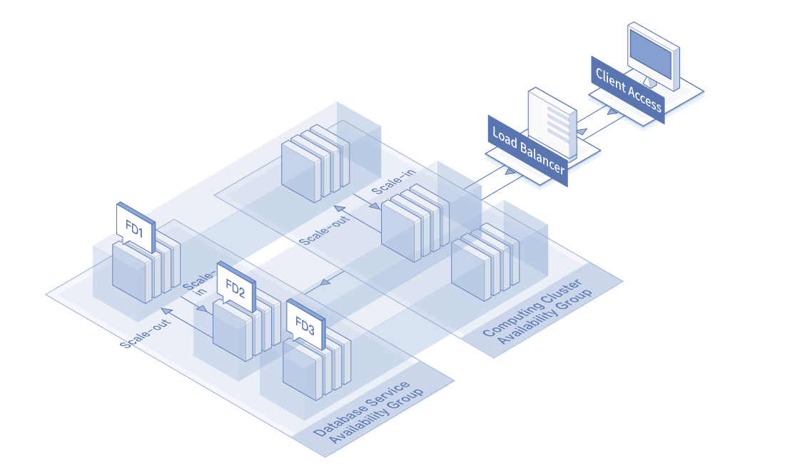

# Application Scenarios

## High availability Web Application

* Scenario Description: Different service can be deployed with different Availability Groups to isolate the impact of service layer failures. JD Cloud Availability Group will ensure that the instances corresponding to Web services are scattered over physical resources, and the instances corresponding to database services are scattered over physical resources too. When the physical resource of a Web service instance fails, other Web service instances and database service instances will not be unaffected, and your business can be available.
* Recommended Configuration: The Web service instance uses an Availability Group, and the database service
*  instance uses another Availability Group. The two Availability Groups span multiple Availability Zones.
* 

## Elastic High Performance Computing Applications

* Scenario Description: Computing requests arrive at the application server through Load Balancer. When your computing load fluctuates, you can configure alarm scaling strategy based on monitoring metrics to automatically trigger adding or deleting of instances, guarantee cluster computing power, and save business deployment costs. If you can predict the amount of volatility, you can plan ahead the number of instances available within the group and configure the fixed-time scaling strategy to trigger adding or deleting of instances regularly.
* Recommended Configuration: The instances of the computing cluster are deployed in an Availability Group, and instances of the database cluster are depolyed in another Availability Group. The two Availability Groups have automatic scaling functions.
 
