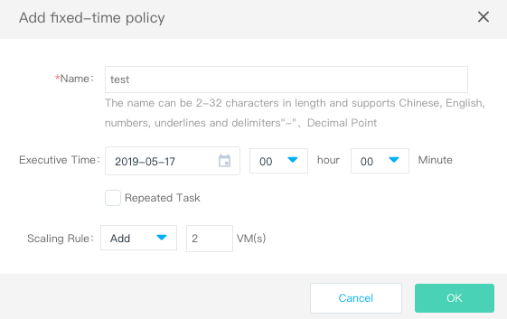

# New auto-scaling policy

After auto-scaling, you can configure auto-scaling policy on demand, including alarm policy and fixed-time policy.

## Alarm policy

The alarm policy is based on the configuration of monitoring metrics (such as CPU, memory utilization) and the number of instances in the dynamically expanded and auto scaling group. It is suitable for unpredictable business fluctuations.

### Operation Steps

1. Access[Availability Groups Console](https://cns-console.jdcloud.com/availabilitygroup/list) to enter the Availability Groups List page. Or access[JD Cloud Console](https://console.jdcloud.com) and then click on the left navigation bar **Elastic Compute**-**Availability Groups** to enter the Availability Groups List page. 
2. Find the corresponding Availability Group and click the name to enter the details page.
3. Click on **Automatic Scaling Tab**-**Alarm policy**-**Add** buttons.
4. An alarm policy is set in the pop-up window to automatically increase or decrease the number of VMs specified for the Availability Group based on monitoring performance metrics (such as CPU, memory, etc.).	

The current statistical cycle supports 2 minutes, 5 minutes, 15 minutes, 30 minutes and one hour. Statistical methods support average, minimum and maximum.

## Fixed-time policy

Fixed-time policy will increase or delete the number of instances in the Availability Groups within specific times and cycles set by you, suitable for predictable business load.
		
### Operation Steps

1. Access[Availability Groups Console](https://cns-console.jdcloud.com/availabilitygroup/list) to enter the Availability Groups List page. Or access[JD Cloud Console](https://console.jdcloud.com) and then click on the left navigation bar **Elastic Compute**-**Availability Groups** to enter the Availability Groups List page. 
2. Find the corresponding Availability Group and click the name to enter the details page.
3. Click on **Automatic Scaling Tab**-**Fixed-time policy**-**Add** .
4. Set up the name, execution time and scaling rules for timing policy in pop-up windows. You can also tick **Repeat Tasks** to perform tasks at a defined interval.	
5. You need to specify the execution time of the timed task and the specific execution operations, such as increasing the number of new Virtual Machines or removing the number of instances. In addition, you can set the repetition cycle and the end time of repetition for the policy. Currently, you can repeat the timing operation between the execution time and the end time of day, week and month.

