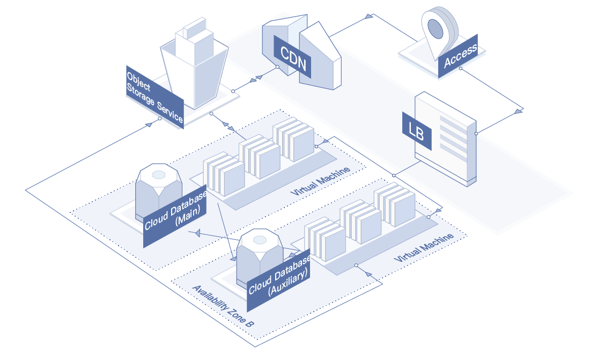

# Application Scenarios
## Enterprise Website/Web Application/Mobile APP
* Scenario Description: For the initial stage of such applications, the traffic is usually small, and the lightweight deployment scheme is adopted. The small instance type and low bandwidth can meet the business requirements and realize the operation of applications, databases, and other services. With the increasing traffic to the websites/applications and the diversification of services, the cloud server specifications and scale can be quickly adjusted, and the resource ratio can be flexibly adjusted according to the business cycle to obtain elastic improvement of the computing power at a small cost.
* Recommended Configuration: Virtual Machines and Load Balancer; instance type of g.s1.micro (1Core, 1GB) and EIP with bandwidth of 1Mbps.

## Mass Images/Video Applications

* Scenario Description: In actual mass picture/video applications, for example,  large E-commerce websites, it is recommended to use Object Storage Service to store your static pictures, videos and other data, and use CDN and Load Balancer at the same time, which can greatly reduce user's costs while reducing the access waiting time.
* Recommended Configuration: Virtual Machines, Load Balancer, Object Storage Service, CDN and database; instance type of g.n2.medium (2-core, 4GB) and EIP with bandwidth of 5Mbps.

