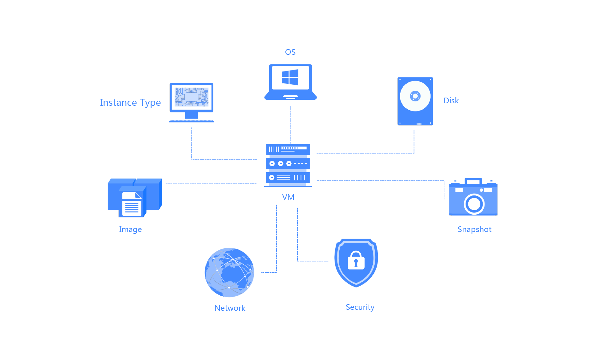

# Product Overview
The Virtual Machines are a basic computing service unit provided by JD Cloud, which provides computing services with flexible processing capabilities. It involves a variety of concepts, as shown in the figure below, including instance type (vCPU and memory), operating system, disk, network, security, etc. Each resource provides a variety of configuration options, you can choose as needed.

Management of Virtual Machines is simpler and more efficient than that of the physical servers, and you can flexibly combine these resources according to actual needs. Besides, you can create a specified number of Virtual Machines at any time through the console, OpenAPI or CLI. During using, it is available to adjust the instance types based on the business scale as well as to release the excess or idle resources to save input costs. JD Cloud Virtual Machines provide you with a stable and reliable foundation to realize rapid deployment of applications and enable you to focus on core business innovation.

## Related Concepts
See [Core Concepts](Core-Concepts.md) for the concepts that are commonly referred to when learning about JD Cloud Virtual Machines.
## Related Services
* You can get all kinds of software and services related to basic software, enterprise software, website construction, entrusted operation and maintenance, cloud security, data and API, solutions, etc. provided by the third-party service providers from the Cloud Marketplace. You can also become a service provider in the Cloud Marketplace. Please refer to the cloud marketplace documentation for details.
* You can use load balancer to automatically distribute business traffic to multiple backend instances. Please refer to[Load Balancer Product Documentation](../../../Networking/ALB/Introduction/Product-Overview.md) for details.
* You can use the cloud monitor to conduct real-time monitoring on your instance, storage and network, and set up exception alarming. Please refer to[Cloud Monitor Product Documentation](../../../Management/Monitoring/Introduction/Product-Overview.md) for details.
* You can use the container service to manage the application lifecycle deployed on one group of VMs. Please refer to[Container Service Product Documentation](../../Native-Container/Introduction/Product-Overview.md) for details.
* You can use the Virtual Machines to set up a database service, or you can use the JD Cloud database service. Please refer to[Cloud Database](../../../Database-and-Cache-Service/RDS/Introduction/Product-Overview.md) for details.
* You can write code to call JD Cloud OpenAPI service to access its products and services. Please refer to[OpenAPI](http://docs.jdcloud.com/api/virtual-machines/overview) for details.

## Using Virtual Machines
JD Cloud provides a Web operation interface - the console. You can use your JD Cloud account to directly login [Virtual Machines Console](https://cns-console.jdcloud.com/compute/list) to manage and operate your Virtual Machines.

JD Cloud also provides APIs for you to manage the VM. For specific information related to API operation of VM. Please refer to OpenAPI Documentation(http://docs.jdcloud.com/api/virtual-machines/overviewd). You can use SDK (support Java/Python/Go/Node.js/PHP/.Net/C++) to program or use the JD Cloud command line tool (CLI) to call the virtual machine API. For details, please refer to: [SDK Documentation](http://docs.jdcloud.com?act=3) and [CLI document](http://docs.jdcloud.com/cli/introduction).

## Billing Instructions
The Virtual Machines support two billing modes, i.e. monthly package and pay by configuration:

* Monthly Package: Monthly service from 1 to 9 months, or annual service from 1 to 3 years can be selected, and the price is lower than the other billing mode. Pay-in-advance is adopted, please pay attention to the expiration time of the Virtual Machines and renew or open the automatic renewal feature.
* Pay by Configuration: The fees are deducted per hour according to your instance configuration and corresponding actual using time (accurate to second). You only need to pre-charge the account before purchase to ensure sufficient balance.

For details, please refer to[Billing Rules](../Pricing/Billing-Rules.md). 

