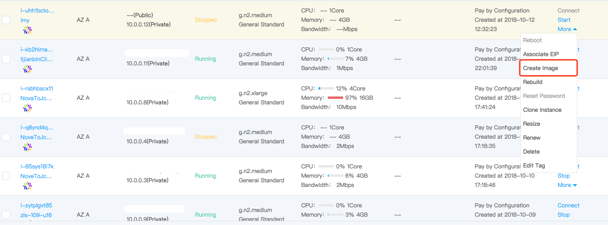

# Create a Private Image Based on an Instance
You can create a private image from an instance created as required, and use this image to launch more instances with the same operating system, pre-installed software, and related configurations as the original instance.

## Precondition
* Cloud Disk and System Disk Instance, support creation of private image in startup (running)/Shutdown (stopped) status.
* Local System Disk Instance, support creation of private image shutdown (stopped) status.
* You must ensure that the image and cloud disk snapshot quotas are sufficient, because if the instance system disk is a cloud disk or the instance attaches a data disk, it will take up the private image quotas and the cloud disk snapshot quotas.

		Note:
		* For the Linux system, if the instance configures the automatic attachment command of the data disk in /etc/fstab or configures 70-persistent-net.rules in /etc/udev/rules.d, please delete it before producing private images, or the instance based on private image creation may not be able to be started normally.
		* If the current instance's system disk is local disk, then the created private image is local system disk image; If the current instance's system disk is cloud disk, then the created private image is cloud system disk image. You can switch local disk system disk images as those of the cloud disk system disk via [Convert Image Type](Convert-Image.md).
		* Data reliability of local disk system disk is far inferior to that of the cloud disk system disk. In case of migration or host machine system breakdown, there are data loss risks. Therefore, images of the local system disk cannot be deleted if their creating machines are available. If image quota is insufficient due to this restriction, please open ticket to apply for quota increase.
		* If the machine mounts a data disk of local disk (e.g. GPU instance type machine), because the local data disk does not support manufacturing snapshot, in this case, the manufactured private image will not be able to include the local data disk.
		
		
		
## Operation Steps
1. Access [Virtual Machines Console][1] to enter the instance list page. Or access [JD Cloud Console][2] Click navigation bar on the left **Elastic Compute** - **Virtual Machines** - **Instance** to enter the instance list page.
2. Select the instance which you want to create a private image and click**More** - **Create Image**.

3. In the pop-up window of create images, supplement the "Name" and "Description" of the private image，click **OK** to start the creation of the private image.
4. In addition to backup system disk, you can back up the existing Cloud Disk data disks attached to the instance while creating images (the local data disk does not support snapshot function). The data disk will be associated with the system disk images in the snapshot form and displayed in the "Device Mapping Information" on the Private Image Details, as the pre-set configuration of data disk for later instance creation with the private image, to realize convenient and rapid overall deployment. If you want to modify the data disk capacity, please make adjustment when creating a machine based on this image. Click here to view details of data disk [Device Name Distribution Rule](../Storage/Assign-Device-Name.md).
5. It takes a long time to make the entire image that contains data of system disk and data disks. In order to avoid the failure, please stop other operations on the VM and the cloud disk during the production process, and ensure that the current instance and the cloud disk snapshot have sufficient quotas.

6. The submitted private image is created successfully into "Available" status after passing through the two intermediate statuses of "Pending" and "Replicating", then it can be used normally. In the intermediate status, operations of **Share**, **Create instance**, and **Delete** on the image are not allowable.

7. In the process of image creating, any resource's failed creation will cause the image to be in the "Error" status. If data disks attached to the instance are selected to create the image that contains data of system disk and data disks, all the snapshots created by the operation will be automatically deleted after the operation failed, but the private image could be deleted after your confirmation.

 
 
## Related Reference
 
[Image Type Conversion](Convert-Image.md)
 
[Device Name Assignment Rule](../Storage/Assign-Device-Name.md)

  [1]: https://cns-console.jdcloud.com/
  [2]: https://console.jdcloud.com/
  [3]: ./images/Operation-Guide-Image-create1.png "Operation-Guide-Image-create1.png"
  [4]: ./images/Operation-Guide-Image-create2.png "Operation-Guide-Image-create2.png"
  [5]: ./images/Operation-Guide-Image-create3.png "Operation-Guide-Image-create3.png"

  [6]: ./images/Operation-Guide-Image-create4.png "Operation-Guide-Image-create4.png"