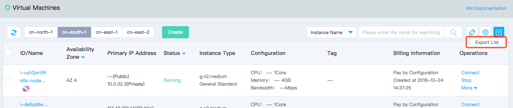

# Export Instance Information

You can export instance list under the specified region through the console. The information currently supported for export is: ID, name, region, availability zone, Availability Group, fault domain, status, image, instance type, primary private IP, EIP and bandwidth associated to the private IP, VPC , subnet, Cloud Disk associated, billing information, label, creation time, and expiration time (for the Virtual Machines that are monthly package billing).

## Operation Steps

1. Access [Virtual Machines Console](https://cns-console.jdcloud.com/host/compute/list) and enter the instance list page. Or access [JD Cloud Console](https://console.jdcloud.com) Click navigation bar on the left **Elastic Compute** - **Virtual Machines** to enter the instance list page.
2. Select a region.
3. Click the export list icon on the top right corner of the Instance list page.   
	
		Note: The export time is affected by the instance items. Please wait patiently if there are more data.
	