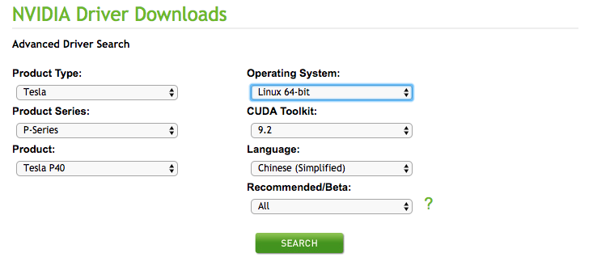
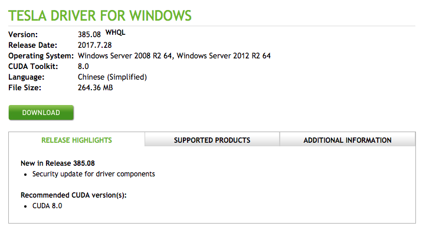

# GPU Virtual Machine


## Download and install GPU Driver

### Windows System


		Please note that the following operation steps are only for reference. Please install it according to your operating system version and demands.

Take Windows 2008 R2 data center version as an example, the steps to install the GPU driver are as follows:

* Get GPU Driver Installation Package:
	* Enter [NVIDIA official website](https://www.nvidia.com/Download/Find.aspx);
	* Manually look up the drive program applicable for the instance, and click **search**. The filter information description is explained as follows. <br>
	* After confirmation, click **Download**, the figure below is the snapshot of Windows Server 2008 R2 Driver. <br>
* Install GPU Driver:
	* In Windows system, double-click directly to install GPU Driver.
* GPU Driver Verification
	* Before installing the GPU driver, the display card information in the device manager is "3D Video Controller", which is shown in the following figure <br>
	* After successful installation of GPU display card driver, the display card will be displayed in the "Display Adapter" drawer, which is shown in the following figure <br>

### Linux System

		Please note that the following operation steps are only for reference. Please install it according to your GPU type, operating system version and specific demands.
		
Take CentOS 7.4 as an example, the steps to install the GPU driver are as follows:

* Get GPU Driver Installation Package:
	* Enter [NVIDIA official website](https://www.nvidia.com/Download/Find.aspx);
	* Manually look up the drive program applicable for the instance, and click **search**. The filter information description is explained as follows. <br>
	* After confirmation, click **Download** twice, the figure below is the snapshot of CentOS7.6 Driver. <br>
	* In CentOS 7.6, the above driver can be directly downloaded through the following commands, wherein the download link can be obtained by right-clicking the download button in the figure above:
	
`wget http://cn.download.nvidia.com/tesla/440.33.01/nvidia-driver-local-repo-rhel7-440.33.01-1.0-1.x86_64.rpm`
	
* Install GPU driver dependency
	* Download and install the kernel-devel and kernel-header packages in the corresponding versions of kernel:
		* Via the "uname -r" command, the kernel version in centos7.6 is 3.10.0-693.17.1.el7.x86_64.
		* Download and install corresponding Kernel-devel package of kernel version and corresponding kernel-header package
		
		Please note that the download versions of kernel-devel and kernel-header shall be identical to that of the running kernel. Otherwise, the gpu driver cannot be normally installed and used.
		
After installation, run the command rpm -qa | grep $(uname -r). If information similar to those below is displayed, it means that the installation succeeded:
```
	# rpm -qa | grep $(uname -r)
	kernel-3.10.0-957.el7.x86_64
	kernel-headers-3.10.0-957.el7.x86_64
	kernel-devel-3.10.0-957.el7.x86_64
```

* gpu Driver Installed and Downloaded
	* Please conduct installation according to guide steps of **Other Information** on the Nvidia drive download page. Operation information for CentOS 7.6 is as follows. Please carry out operation as per actual display on the page. <br>

* GPU Driver Verification
	* Execute command below after installation:
```
nvidia-smi

```
	
	* If information similar to those shown in the figure below is displayed, it means that the installation succeeded.
<br>
	
