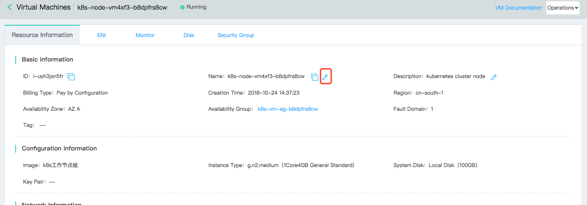
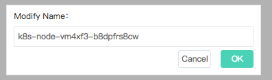

# Modify Instance Name

You can modify your instance name as needed.

## Operation Steps
1. Access [Virtual Machines Console](https://cns-console.jdcloud.com/host/compute/list) and enter the instance list page. Or access [JD Cloud Console](https://console.jdcloud.com) Click navigation bar on the left **Elastic Compute** - **Virtual Machines** to enter the instance list page.
2. Select a region.
3. Select the instance that needs to modify name in the instance list and click the instance name to enter the details page.
4. Click **Resource Information** - **Basic Information** - **Name** to modify the icon on the right. 
5. In the "Modify Name" pop-up window, enter the new instance name as needed, and click **OK** to submit the modification. 

