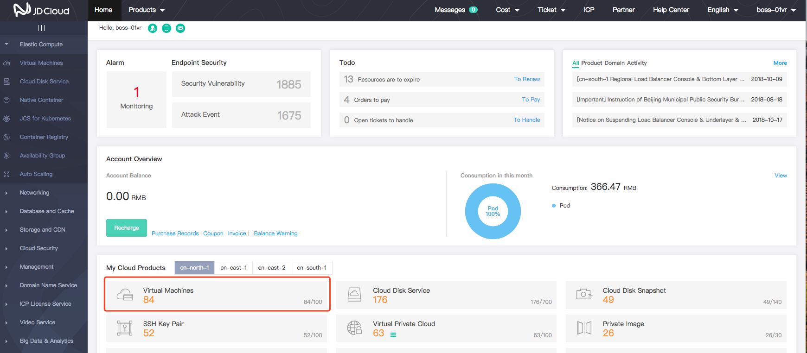
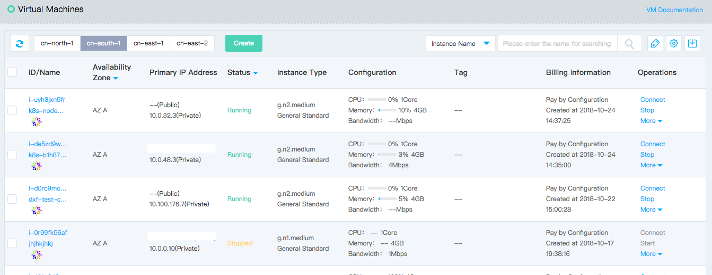
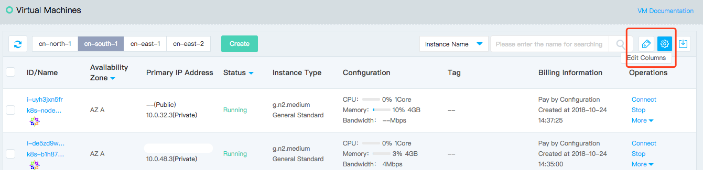
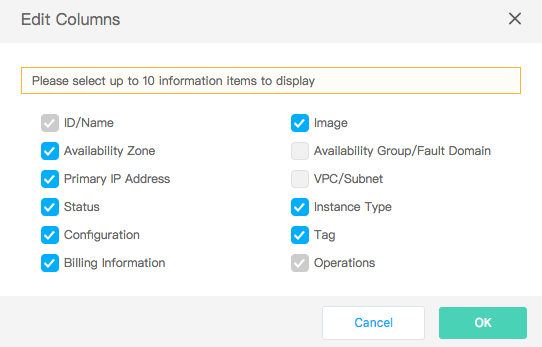

# View Instance

You can view the instances you have through the console:

* [Overview Page](Query-Instance-Info#user-content-1): You can view the number of region instances and quota under the current account.
* [Instance List Page](Query-Instance-Info#user-content-2): You can view the information about all instances in each domain, including ID, name, Availability Zone, IP Address, and so on.
* [Instance Details Page](Query-Instance-Info#user-content-3): You can view the details of the specified instance.

## Overview Page

[Overview Page](https://console.jdcloud.com) is the default home page for logging in to the JD Cloud console. You can view the number of region instances and quota in the current account. 

	
	

## Instance List Page

1. Access [Virtual Machines Console](https://cns-console.jdcloud.com/host/compute/list) and enter the instance list page. Or access [JD Cloud Console](https://console.jdcloud.com) Click navigation bar on the left **Elastic Compute** - **Virtual Machines** to enter the instance list page.
2. Select Region. 

	You can view the information about all instances in the selected territory, including ID, name, availability zone, IP address, and more. Since there are many instance information items, you can adjust the items displayed on the instance list page through Edit Columns as needed. The detailed steps are as follows:

3. Click the Edit Columns on the top right corner of the instance list page icon 

4. In the pop-up window of the edit columns, select the item you want to display and click **OK**. 

		Note: The current list supports up to 10 items of information.
		
You can also view related information from the instance list page to VPC, Subnet, and Availability Group, etc. of instance.

	
## Instance Details Page

1. Access [Virtual Machines Console](https://cns-console.jdcloud.com/host/compute/list) and enter the instance list page. Or access [JD Cloud Console](https://console.jdcloud.com) Click navigation bar on the left **Elastic Compute** - **Virtual Machines** to enter the instance list page.
2. Select a region.
3. In the instance list, select the instance for which you want to view the details, and click the instance name to go to the details page.

You can view the following instance information:

* Basic Information: ID, Name, Description, Billing Type, Creation Time, Expiration Time (monthly package billing type), Region, Availability Zone, Availability Group, Fault Domain, Tag
* Configuration Information: Image, Instance Type, System Disk, Key Pair
* Network Information: VPC, Subnet, Private IP, EIP

You can also view the related information from the instance details page, such as VPC, Subnet, Availability Group, cloud disks attached , ENIs attached , security groups associated and the monitoring and alarm.
