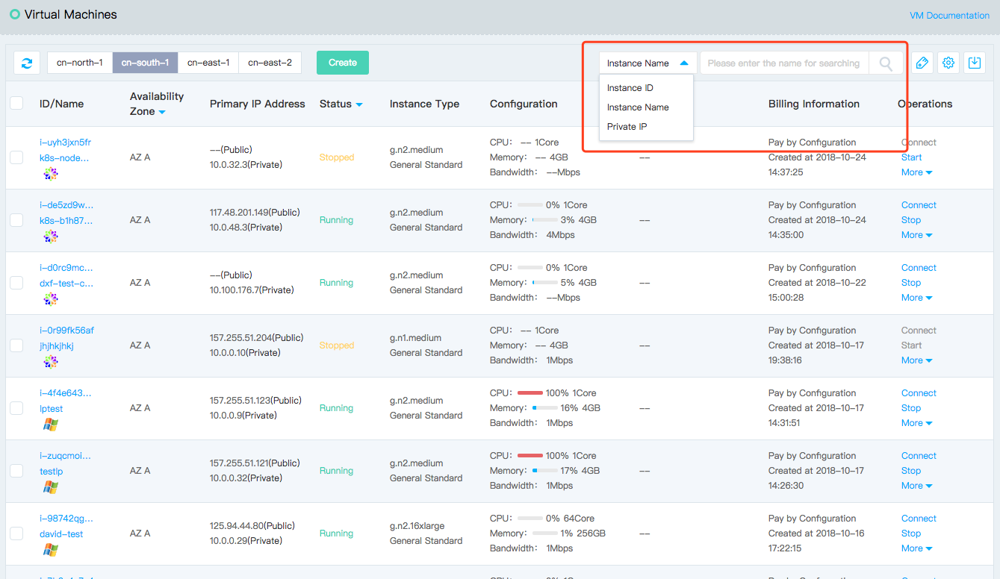

# Search Instance

By default, all instances under the current region will be displayed in the instance list. To help you rapidly search specific instances under the current region, JD Cloud provides instance search functions. Now, search by instance ID and name
, primary private IP of primary network interface, image ID and instance type is supported. Instance ID, image ID and instance type support advanced search, while name and primary private IP of primary network interface support fuzzy search.

## Operation Steps

1. Access [Virtual Machines Console](https://cns-console.jdcloud.com/host/compute/list) and enter the instance list page. Or access [JD Cloud Console](https://console.jdcloud.com) Click navigation bar on the left **Elastic Compute** - **Virtual Machines** to enter the instance list page.
2. Select Region
3. You can select the search conditions: Instance ID, instance name, primary private IP of primary network interface corresponding to instance, image ID and instance type. Enter search keywords in the right-side input box and click search icon for search.
