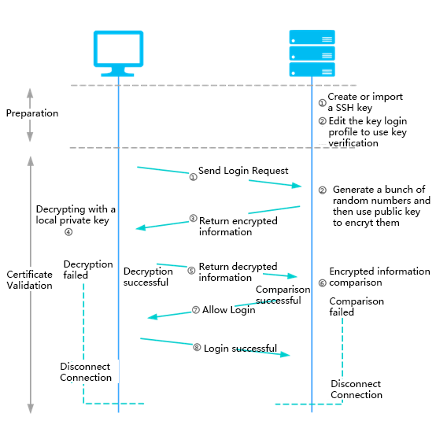

# Key Pair Overview
JD Cloud provides you with two safe and reliable login instances: password login and key pair login. Only Linux system instances support the use of key pair.

Key pair login refers to the use of key pair technology to encrypt and decrypt the login information, providing a more secure login mode for Virtual Machines compared with password login, which further enhances the security of Virtual Machines.

For key pair login, you need to create a pair of unique matching key pair: "Public Key Pair" and "Private Key Pair":

* The public key pair needs to be stored on JD Cloud to encrypt the data. The public key pair is public and can be configured to the target server as needed to associate with the username you use.
* The private key pair needs to be stored in a secure location. The private key pair can only decrypt the data encrypted by the matching public key pair. The SSH client uses the private key pair to prove your legal identity to the server.

## Principle Process
The process of logging in to an instance using key pair is as follows:

### Preparation Phase:
1. You create a key pair (newly generated or imported) and save the private key locally.
2. Edit the remote Virtual Machines key pair login configuration file and write the public key pair information to the corresponding directory file.

### Certificate Verification Interaction Phase:

1. The user sends a login request to the remote Virtual Machines.
2. The remote Virtual Machines reads the valid public key pair of the Virtual Machines in the corresponding user directory and file, generates a string of random numbers, and encrypts it with the public key pair.
3. The remote Virtual Machines returns it to the user.
4. The user decrypts it by the local private key pair.
5. The user returns the decrypted result to the remote Virtual Machines for information comparison. If the matching is successful, the user logs in successfully, otherwise the login fails.

JD Cloud provides instance operator of key pair creation and corresponding management injection in the console. In addition, it also allows you to configure the instance correspondingly on your own. For details, please refer to [Create Key Pair](../Operation-Guide/Key-Pair/Create-Keypair.md).

## Related Reference

[Create Key Pair](../Operation-Guide/Key-Pair/Create-Keypair.md)

  [1]: ./images/Operation-Guide-keypair-overview1.png "Operation-Guide-keypair-overview1.png"