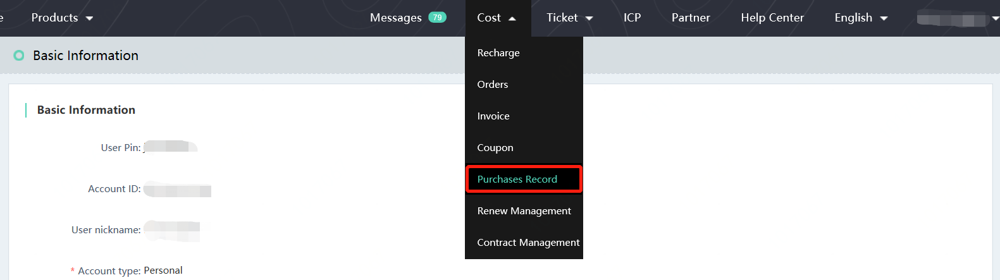
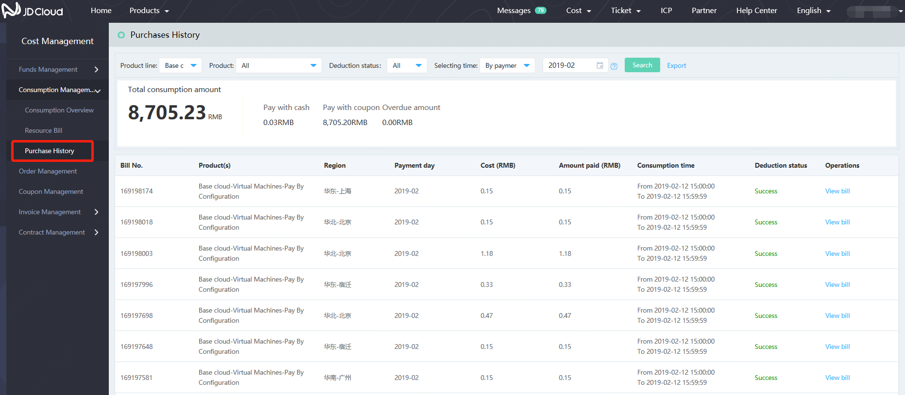

# Consumption Records
## What is consumption records?
The consumption records reflect the details of each consumption and the bill details of you on JD Cloud;
You can query the consumption records of a certain period or a certain account period;

## How to view the consumption records?
In JD cloud console, click on **expense**-**consumption records** to view;

