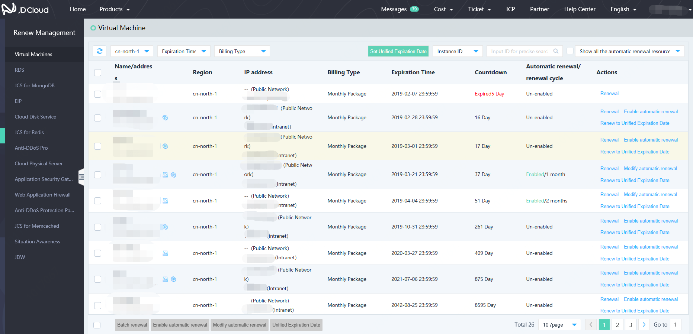
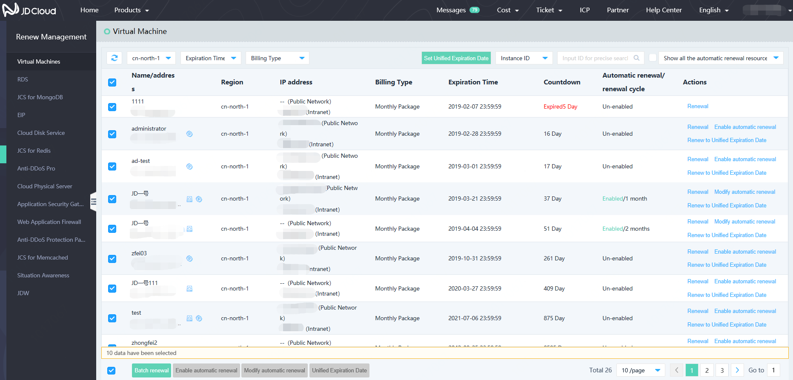

# Renew Management
## Resource Renewal of Single Set
When the user makes the independent renewal action to a single paid resource, the resource expiration time will be updated after the user selects the renewal period and successfully renews the resource. The resource billing type can be changed to be the monthly package in the renewal process by configuring the billing resources.

There are two renewal methods available:

1. The resource renewal actions are made in the resource management console;
2. The resource renewal actions can be made to the selected resources in the [Renew Management](https://renewal-console.jdcloud.com/renew) page.

The Renew Management page supports resource screening based on resource region, expiration time range, resource billing type, etc., thus facilitating your search.

## Resource Renewal in Batches
The renewal in batches refers to that the same resources with the billing type of monthly package are renewed. In the renewal in batch process, the user can make the renewal action to the resources with relevant association relationship. The resource expiration time can be updated after successful renewal when the user selects the renewal period.

The resource renew actions can be made to the selected resources in the [Renew Management](https://renewal-console.jdcloud.com/renew) page. When there are many resources, you can select all resources of different pages and submit the renewal action in batches.

## Setting of Automatic Renewal
 The renewal setting function is provided to the user for the purchased monthly package resource intended to be used for a long period.

You can implement the automatic renewal setting for the monthly package resources in the [Renew Management](https://renewal-console.jdcloud.com/renew) page.

1. Automatic renewal supports setting, modification and cancellation. For the resources for which the automatic renewal function has been canceled, we will recover the normal expiration check and remind to such resources.

2. For the resources for which the automatic renewal function has been set, it will be extended to corresponding period by automatic renewal according to the renewal term selected by the user after the resources are expired.

3. The charge will be withheld 7 days (natural day) before the service expiration day for the automatic renewal and the real-time bill will be provided. Please view the bill in the "Purchases Record" page.

4. If the withholding is failed for automatic renewal, the withholding will be made for the automatic renewal at 08:00AM per day until the service expiration date or until such withholding is successful. If the available balance in your account is insufficient, the automatic renewal will be disabled. Please be sure to keep sufficient balance in your account.

5. The automatic renewal is not available to the expired resources.

6. If the automatic renewal function is enabled and the renewal is made by the user manually, the automatic renewal can be enabled on the expiration time of the manual renewal.

## Automatic renewal for synchronized subscription of new purchase
When users purchase new resources and have definite renewal demands subsequently, they can synchronously set and subscribe the automatic renewal function while purchasing. Once resources are created, they will be automatically renewed subsequently.

## Non-renewal setting upon expiration
Provide the user with the function of stopping use of expired resource and setting non-renewal option for resources. Resources in the non-renewal setting can be managed by screening corresponding types.

You can make the non-renewal setting upon expiration for resources on the [Renewal Management](https://renewal-console.jdcloud.com/renew) Page.

Resources with the setting of on-renewal upon expiration can be recovered to manual renewal resources.

## Setting of unified expiration date
You can renew instances to the same day of each month by virtual of the unified expiration date.

Restrictions for unified expiration date are as follows:

Interval between the expiration date of current billing cycle and the unified expiration date cannot be less than 1 month.
If such interval is less than 1 month, the unified renewal will be extended to the first expiration date after a 30-day period. When the renewal is extended to the unified expiration date, the system will calculate the renewal price at the monthly price.

For example, if you have 2 ECS instances in Monthly Package and the expiration dates are September 10, 2018 and May 17, 2018 respectively, the unified expiration date is set to be the 1st day of each month. Upon expiration date of the two ECS instances, they are respectively renewed to November 1, 2018 and July 1, 2018.

Only undue ECS instances in Monthly Package are supported.
On the unified expiration date, if the selected ECS instances comprise any expired ESC instances, the operations will fail. You need to remove the expired ECS instances at first or manually remove the ECS instance at first and carry out operations then.

1. Applicable objects: Unexpired resources in Monthly Package (those paid by configuration and expired are not supported)

2. Renewal duration: Interval between the unified expiration date when the renewal finally comes into force and the expiration of existing billing cycle must be equal to and greater than 1 month.

In case the interval between the expiration date of existing billing cycle and the latest unified expiration date is less than 1 month, the renewal will be extended to the next unified expiration date. When the renewal is extended to the unified expiration date, the system will calculate the renewal price at the daily price.

Example:
If you have 2 instances and the expiration dates are September 10, 2019 and May 17, 2019 respectively, the unified expiration date is set to be the 1st day of each month. Then, they are respectively renewed to November 1, 2019 and July 1, 2019.

3. The optional setting range for unified expiration date is "the 1st day of each month - 28th day of each month".

