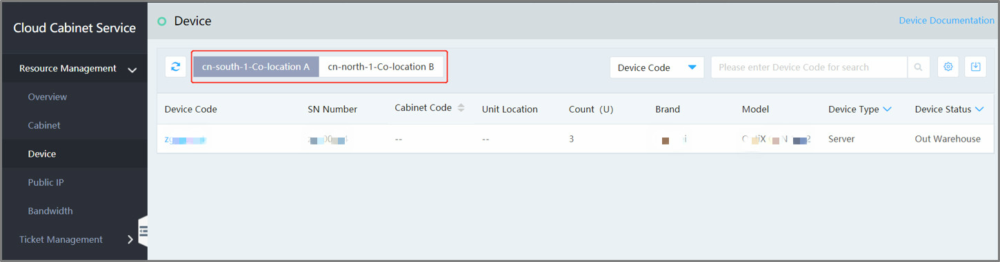
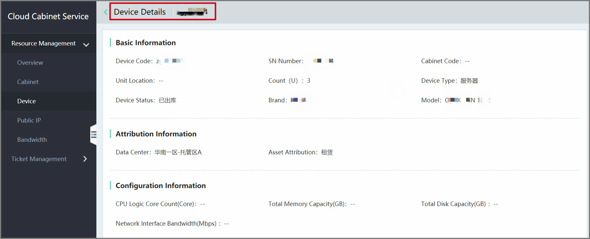

# View the Device List

Open the Console and select Hyper-Converged IDC -> Cloud Cabinet Service -> Resource Management -> Device to view the Device List, as shown as below: 

Click on the **Data Center** tab at the top to switch the Data Center and view the Device List separately.

# View the Device Details

Click on the **SN** to skip to the Device Details page which displays the information in three portions, including basic information, hosting information and configuration information as shown bellow:

