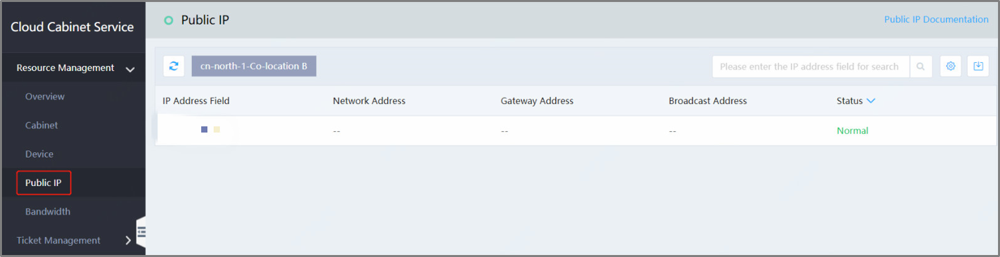

# View the Public IP List
Open the console andselect Hyper-Converged IDC -> Cloud Cabinet Service -> Resource Management -> Public IP to view the public IP list, as shown bellow:  
Click on the **Data Center** tab at the top to switch the Data Center and view the Public IP List separately

