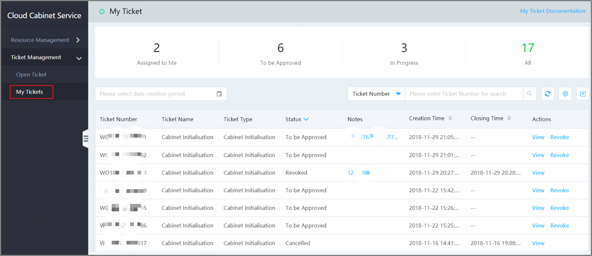
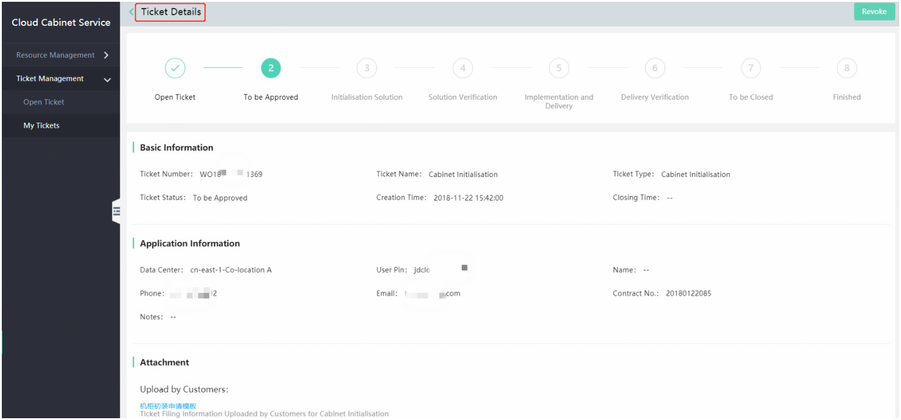

# View the Tickets List

Open the Console and select Hyper-Converged IDC -> Cloud Cabinet Service -> Ticket Management -> My Tickets to view the Work Order List. You can view all the tickets that you have submitted;  
JD Cloud will notify you by mail and SMS after you submit the ticket, convenient for you to view the process schedule.  
The tickets are divided into four categories: "Assigned to Me", "To be Approved", "In Progress", "All", as shown below:

# View the Tickets Details
Click on the **View** in the tickets list to skip to the Ticket Details page, as shown below

