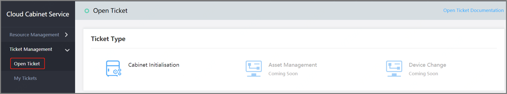

# Open Ticket

Open the Console, select **AIDC**->**Cloud Cabinet Service**->**Ticket Management**->**Open Ticket**, as shown in the following figure:

Click on the **Cabinet Initialization** template to skip to the Open Ticket page, where the customers are required to fill in the information, support saving of ticket or immediate opening, as shown below:

After filling in the above information, click on **Submit** button to complete the ticket submission, and skip to My Tickets list for view.
