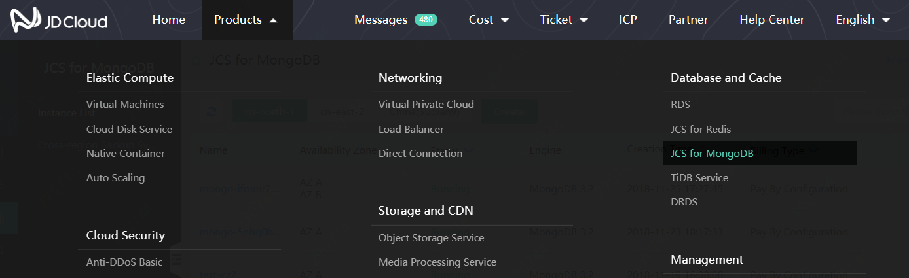
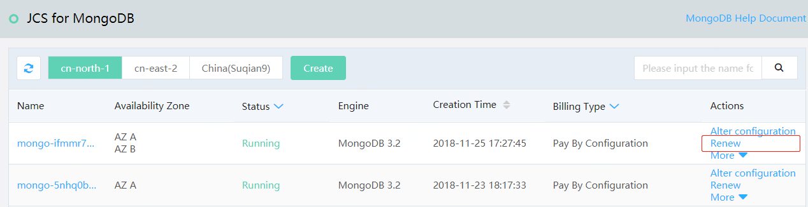
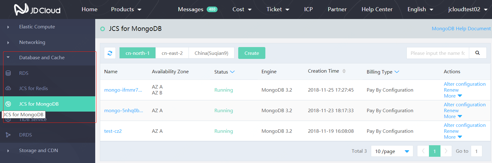

# Renew Process

This document specifies the Renew Entrance of the MongoDB instance.

## Entrance 1: [MongoDB Console](https://mongodb-console.jdcloud.com/mongodb)
1. Log in [JD Cloud Console](https://console.jdcloud.com/overview).
2. Via the header navigation, click **Product** >  **MongoDB** in sequence and turn on the "Instance List" page; or click **Database and Cache** > **MongoDB** in sequence and turn on the "Instance List" page.

    

3. Click **Renew** in the operation bar and enter the "Renewal Page". For renewal steps, please refer to "[Renewal Instance](../Operation-Guide/Instance-Management/Renewal-Instructions.md)"

    

## Entry 2: [Renewal Management Console](https://renewal-console.jdcloud.com/renew/mongodb)
1. Log in JD Cloud Console.
2. Click **Product** > **Renew Management** in sequence in the header navigation to open the "Renew Management" page; or click **Management** > **Renew Management** in sequence in the left menu to open the "Renew Management" page.

    

3. Click **MongoDB** in the "Renew Management" page and view the MongoDB instance.
4. Click **Renew** in the operation bar and enter the "Renewal Page". For renewal steps, please refer to "[Renewal Instance](../Operation-Guide/Instance-Management/Renewal-Instructions.md)"

    
