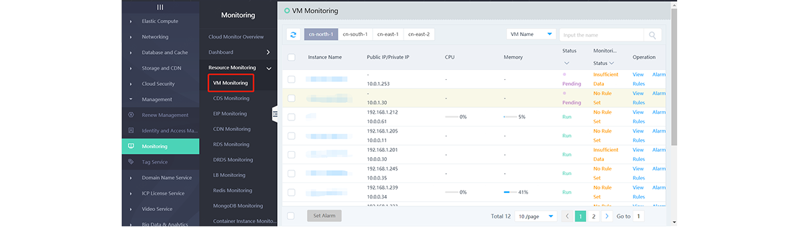

## View the Cloud Resource Monitoring Graph
The Monitoring Graph of the Cloud Resource can be viewed in two ways, one is to view on the Cloud Monitor page, and the other is to view in the Resource.
### Monitoring Page View

1. Log in the JD Cloud Console - Cloud Monitoring Menu to view the monitoring list of each resource.

2. Click on the **View** in the operation column of each instance, the monitoring data of each metric of the instance will be seen.

### Resource Inside View
1. Enter the JD Cloud Console, you can enter the Cloud Product Management page supported by the Monitoring, click on a resource to view the details.

2. Click **Monitoring**to enter the monitoring page of the resource, the monitoring data of each metric of the instance will be seen.
