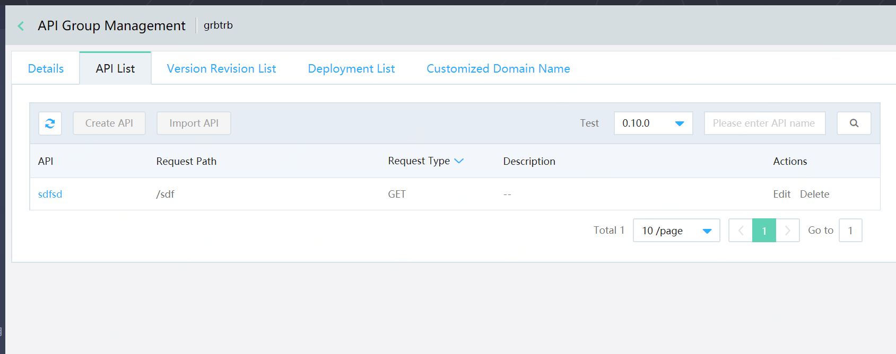
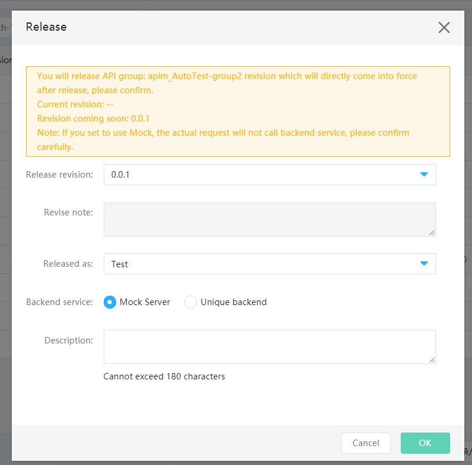

# API Advanced Configuration

In the process of releasing API group, the advanced configuration function provides the configuration function for the real service of API, which is not compulsory for release. Specifically, the configuration provides the following functions:

- When API is called, the API Gateway will convert the parameter passed in from the frontend request to the corresponding backend service according to the advanced configuration.

- The API Gateway releases API based on the group, that is, all API will use the backend service defined on the API group, while the advanced configuration function can configure the backend service of the API in the group separately. For example, there are 5 API in the same group, in which API1 uses advanced configuration and separately configures the backend service. After the API group is released, API1 uses its configured backend service, while the other 4 use unified backend service configured on group.

#### Entry
Middleware>API Gateway>API Group Management>Manage API, select API and click the Advanced Configuration function in the operation.

####   Description:

Currently, the backend service type supports the following methods:

- HTTP/HTTPS。

- Mock backend.

- Function (Function Service). Currently, it supports to configure the function type backend for a single API only, while the configuration function type backend for API group is not supported.

##  Operation Steps:
###  Step 1: Enter the management page of API
First, select the API group, click Manage API menu, and enter the API list page.
 
Description:
If the current API group is a version in the deployment, it cannot be operated directly. If the operation is required, please go offline at first or add a new version for amendment.

###  Step 2: Enter the advanced configuration page for operation
####  Type 1: Default: use the backend configured on the API group
When this type of configuration is selected, the API will use the address content configured when the group is released when the API is actually called.

 
 
 
When this configuration is selected, the backend address used by the API when it is actually called will be the unified address configured when API group is released. I.e., the backend service address configured in the following figure.

####   Type 2: Customized independent backend.
When this configuration is selected, it is to cancel the selection of “Unified Configuration While Releasing the Group”, then when the API is actually called, the backend address that is configured here separately is used as the real request address.

##### 1、HTTP/HTTPS

 
 
 If this type is used as the backend, the real backend service address of API needs to be filled in.
 

##### 2、Mock

 
 
If Mock is used as the backend, the actual request will not call the real backend service.

##### 3、Function

 
 
If this type is used as the backend, you need to create a function in the function first, then find and select the function in the drop-down box.
######  Special description: Currently, it supports to configure the function type backend for a single API only, while the configuration function type backend for API group is not supported.
