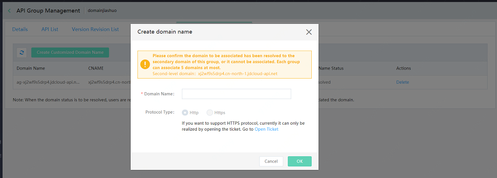

# Customize Domain Names

API gateway offers the domain name association based on API group. The API gateway locates to an unique API group through the domain name, and then determines the unique API through the Path+HTTPMethod. The independent domain name requires to satisfy with following points:

* The independent domain name is analyzed to secondary domain name of this group by CNAME and then associate. Analyze and then associate, otherwise impossible to be associated.

* One domain can be associated with multiple groups. You can distinguish different API groups according to group path prefixes.

* Each group can support association of 5 customized domains at most. If you need to add domains, please open a ticket for application and provide domain and certificate information, via which we can help you complete the customized domain processes.

* The domain name can be associated successfully only after recorded.

* The customized domain only supports on-line public network domain rather than other cases.

## Process of Adding New Customized Domain Name
### Operation Steps:
#### STEP1: enter the page of API group details, click customize domain name **Tab**.

#### STEP2: Click **Add New Domain name** to add a new one. Currently each group supports to associate 5 customized domain names at most.

