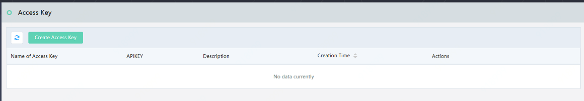
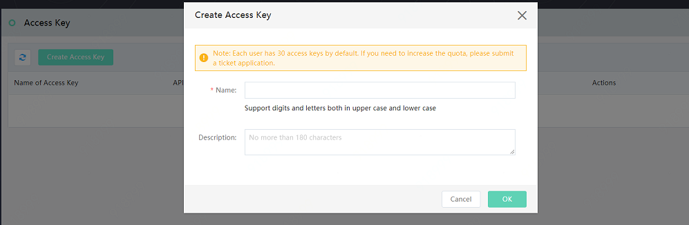
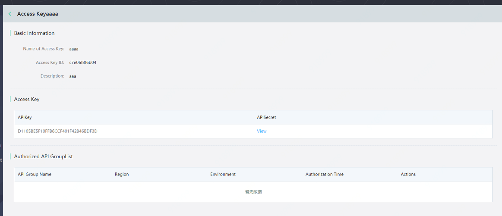
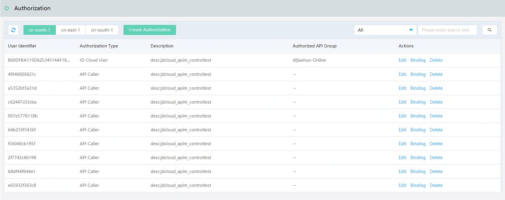

# Access Authorization for API

The process of access authorization of API means that the API provider authorizes API caller to access the API group. The authorization process is divided into two parts:

* API caller creates and provides **Access Key**. The access key (APIKey/APISecret) represents the identity of the requester.

* API provider authorizes the API group to API caller.

When the customer of API provider or himself needs to test the API calling, it is necessary to create the access key as the identity of requester, and then the API provider authorizes the API group to API caller via access key.

## Operational Steps
### API caller creates and provides **Access Key** 
#### STEP1: Click the **Access Key** at left menu to enter the page of access key list

#### STEP2: Click **Create Access Key**

* After creation of key pair, the system will automatically generate access key ID, API key and API Secret.

* API caller needs to send **APIKey** to API provider, and then the API provider perform the authorized access to APIKey.

### API provider authorizes the API group to API caller

#### STEP1: API provider obtains the Access Key ID of API caller .

API caller can find the access key ID in the access key details page and tell this ID to API provider.

 
 

 
#### STEP2: API provider creates 1 authorization.

Enter the list page of **Access Authorization** at left menu firstly

Then click **Create Authorization**, and fill the Access Key or AK offered by API caller in the authorization information.

#### STEP3: API provider binds the authorization and API group

Click **Bind** to bind the authorization group after creation of key pair.

  
