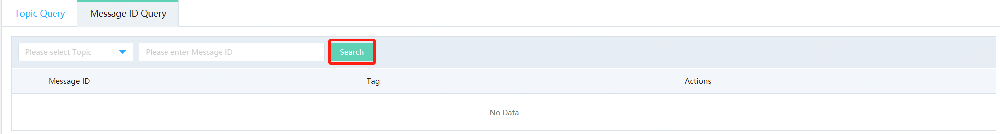
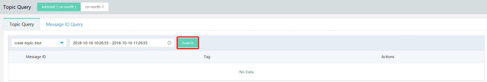

# Query Messages
Message Queue provides three message query methods: Query by Business ID, query by Message ID, and query by Topic time range.

## Prerequisites
- The message has been sent in the queried topic.
- The queried message is in the message life cycle (3 days).

## Procedure
1. Go to the Message Queue Console and select Message Query on the left menu.
2. Select the region where the message to be inquired is located. Any tag can be selected. Enter the information for message query.

### 1. Query by Business ID

Enter or select the topic name that you want to query, then enter the Business ID customized by the user and click **Search**.  
Click a message to view message details or message trace.

Rules:
- Java SDK ([Version](https://mvnrepository.com/artifact/com.jdcloud/jcq-java-sdk)): Messages sent through V1.3.0 or above version support Business ID query functions
- Only messages with Business ID included in its message properties can be queried by Business ID.
- Up to 256 messages including specified Business ID can be returned in case of query by Business ID, so it is recommended that the Business ID set by each message producer shall be globally unique as far as possible, or the complete set may not be returned.

### 2. Query by Message ID

Enter or select the topic name that you want to query, then enter Message ID and click **Search**.  
Click a message to view message details or message trace.

### 3. Query by Topic

Enter or select the Topic name and time range that you want to query, and then click **Search** to obtain query results.  
Click a message to view message details or message trace.

## Query Result
The query list displays Message ID, Business ID, Tag and storage time of messages. You can further view message details, which include message trace.
#### Message Details
Query details display Message Body, Userproperties and message body size in detail.

#### Message Track
The message trace part can display the complete production and consumption process of messages. For details, please refer to [Message Trace](Message-Trace.md).
