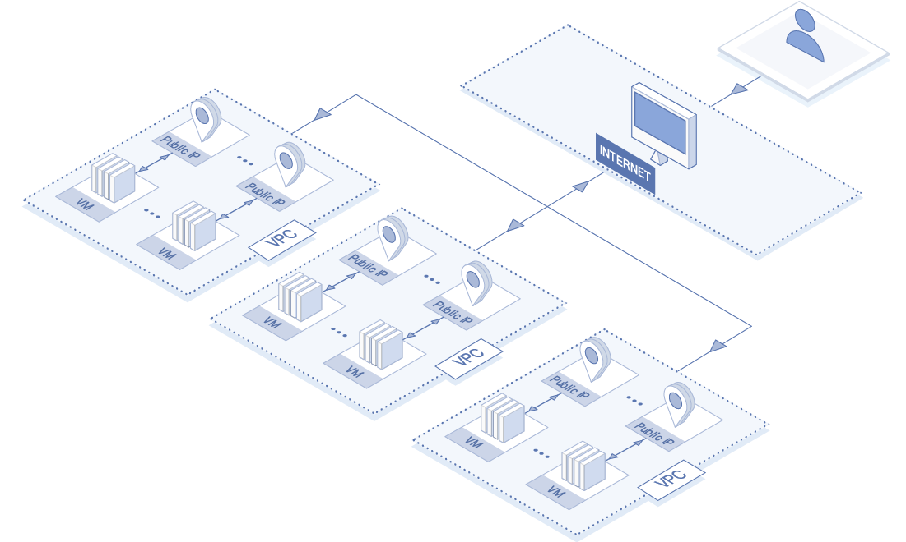
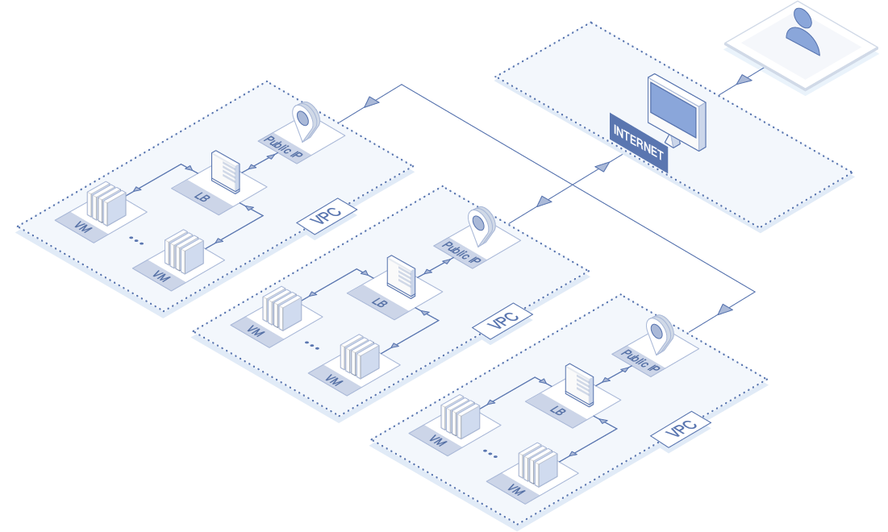
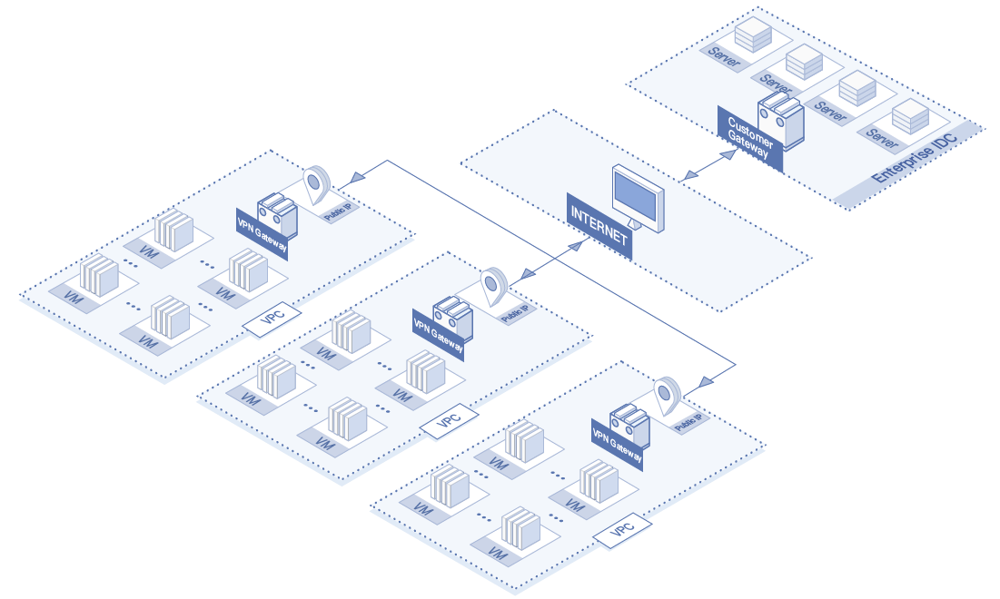

# Application scenario

The scenarios applicable to the Elastic IP are described as follows.

## Elastic IP Associating with Virtual Machine
The Elastic IP supports flexibly associating with and disassociating from Virtual Machine, and can provide access to public work for Virtual Machine. The application scenario is shown in the figure below.

## Elastic IP Associating with Load Balancer
The Elastic IP supports flexibly associating with and disassociating from the Load Balancer, and can be taken as the virtual IP address of Load Balancer. The application scenario is shown in the figure below.

## Elastic IP Associating with NFV Instance
The Elastic IP supports flexibly associating with and disassociating from various NFV instances, including VPN Gateway and NAT Gateway. And the application scenario herein will be described based on VPN Gateway in this Tutorial.

