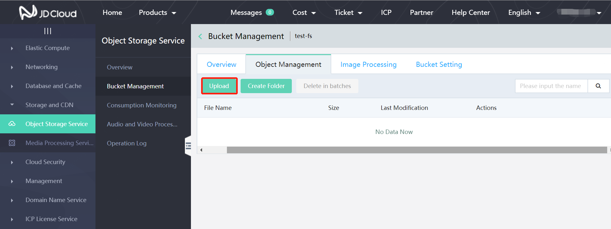
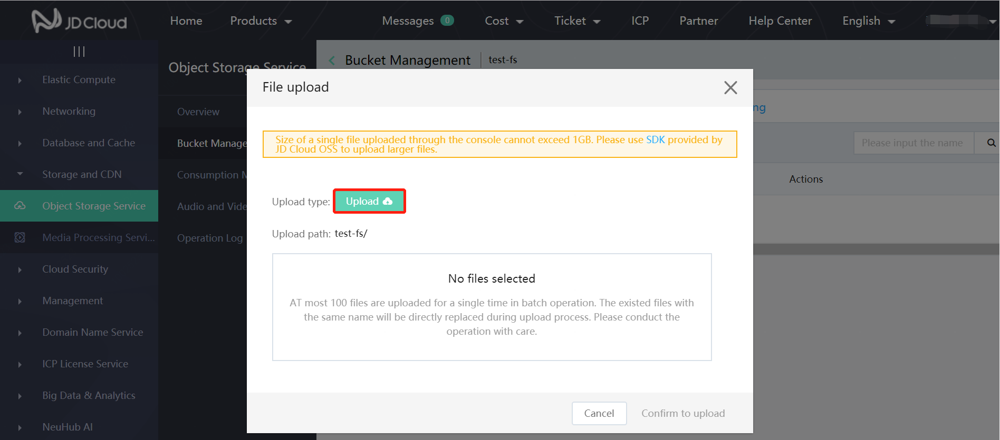
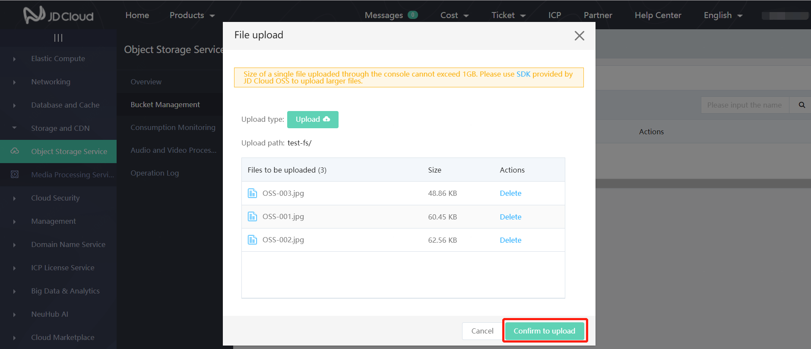

# Upload Object

When you successfully create the bucket, you can upload any type of files to the bucket. You can upload an object less than 1GB via the Object Storage Service console. If you need to upload objects greater than 1GB, please upload them by way of Object Storage Service API or SDK.

1.Enter Object Storage Service console and then bucket management; click the bucket to which you need to upload files in the bucket list.

2.Click to enter the object management list page of this bucket; click **Upload**:

 3.Click and then the below popup shows; you can upload in batches.

 4.Click **Object upload** in the popup; select the file to be uploaded and then click **Confirm to upload** to begin uploading:

 5.After uploading, click **Close** to close the popup.
