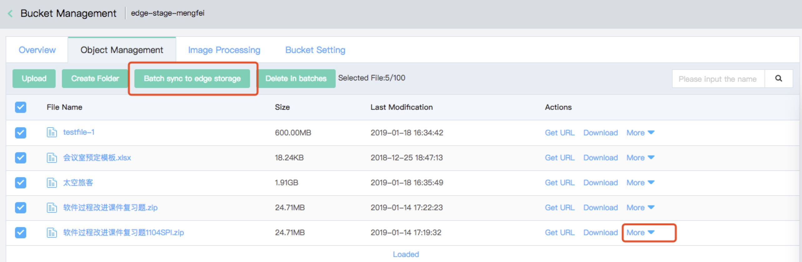
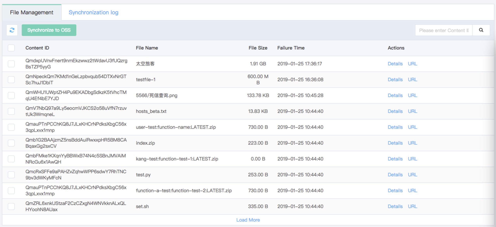
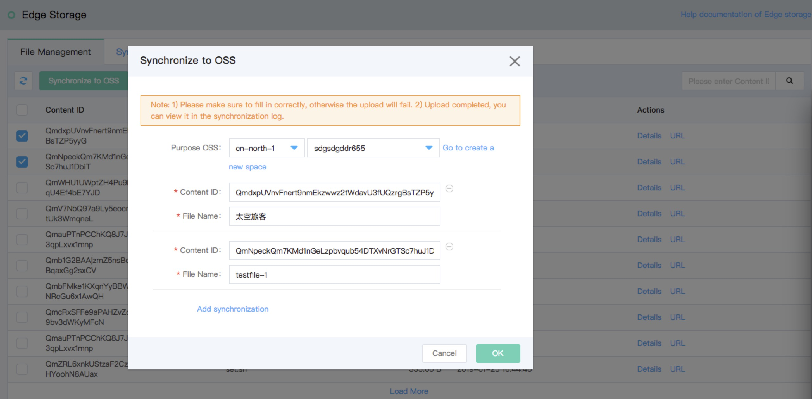

# Edge Storage

The underlayer of the Edge Storage takes advantage of the system established by IPFS (Interplanetary File System), having the features below:

1. Naturally support cross-region replication and improve data reliability.

2. With flexible replica policy, keep the balance between reliability and cost for the user.

3. Via natural P2P network distribution features, save user’s bandwidth cost.

* Customer Scenario: [Monitoring Video Storage](edgeStorage#user-content-1), [Edge Storage of Internet of Things](edgeStorage#user-content-2), [Data Storage and Backup](edgeStorage#user-content-3), [Internet Information Security](edgeStorage#user-content-4) and [Block Chain Application](edgeStorage#user-content-5)
* Console operation process: [Enable “Edge Storage” Service](edgeStorage#user-content-6), [Synchronize OSS to Edge Storage](edgeStorage#user-content-7) and [Synchronize Edge Storage to OSS](edgeStorage#user-content-8)
* API Unified Information: [API Unified Information](edgeStorage#user-content-9)
* API details: [Synchronize to Edge Storage](edgeStorage#user-content-10), [Synchronize Edge Storage to OSS](edgeStorage#user-content-11), [View File Management](edgeStorage#user-content-12)and [View Synchronization Logs](edgeStorage#user-content-13)
* FAQ: [FAQ and API List](edgeStorage#user-content-14), [Can the non-public network IPFS files be synchronized to OSS? ](edgeStorage#user-content-15)

## Customer Scenario

Setting up the Edge Storage may be helpful when you have the following needs: 

<div id="user-content-1"></div>
* Monitor video storage: For locations with monitoring demands, such as urban traffic, schools, government, industrial parks, commercial buildings, smart homes and hotels. The common features of the above scenarios are that plenty of monitoring devices are distributed in such scenarios. However, due to the limited local storage, it is unable to meet the requirements of increasing video data bulk.

<div id="user-content-2"></div>
* Edge Storage of Internet of Things: The edge node storage demand is increased with the increasing edge devices of the Internet of Things. As the off-line storage application scenarios, the storage service is deployed on the edge node, the data are accelerated and stored in the edge node and the data saved in the user’s data center or the Cloud persistently.

<div id="user-content-3"></div>
* Data storage and backup: Be used for scenarios such as log files, images, videos, audios, static website escrow, backup, archive, and private cloud storage. Meanwhile, it shall be used for local data backup, cross-cloud data backup of vendors and other scenarios.

<div id="user-content-4"></div>
* Internet information security: In recent years, several users’ information leakage incidents have occurred in large scales in domestic due to the hacker’s invasion, causing great loss and influence to the user. If the decentralized storage architecture is adopted, all data accesses will be distributed on different nodes. The hacker needs to attack all nodes if he/she intends to invade the data. With such architecture, the data security is effectively guaranteed and the user’s privacy is protected.

<div id="user-content-5"></div>
* Block chain application: Support as the underlayer of data storage under chains.


## Console Operation Process


1. Enable the "Edge Storage" service
<div id="user-content-6"></div>

1) Log in the Console->Object Storage Service->Space Management->Enter a Bucket->Space Settings->Edge Storage


2) Click **Start** upon confirmation.


Description: The following action can be made only when it is confirmed that the "Edge Storage" service is enabled.

2. OSS Synchronization to Edge Storage
<div id="user-content-7"></div>

1) Log in the Console->Object Storage Service->Space Management->Enter a Bucket->Object Management


2) Synchronize a single file or files in batches.



3) Click **Synchronize to Edge Storage** or **Synchronize to Edge Storage in batch** to display files selected and synchronization details.


4) Click **OK**, then the task amount will be displayed on the upper top of the page and the details can be viewed.

3. Synchronize Edge Storage to OSS.
<div id="user-content-8"></div>

1) Log in the Console->Object Storage Service->Edge Storage->File Management


                      
2) Synchronize a single file or files in batches.



Where the user has its own IPFS nodes and hopes to store its own files in OSS, please directly click **Synchronize to OSS** and fill in the information as shown in the figure below, without selecting any file.


3) View Synchronization Log


## API Unified Information
<div id="user-content-9"></div>

- Service domain: apigw-internal.cn-north-1.jcloudcs.com
- Verification: [JD API Gateway](https://www.jdcloud.com/cn/products/api-gateway) Unified Verification

## API Detail

### 1. Synchronize to Edge Storage
<div id="user-content-10"></div>

POST /v1/regions/{region}/tasks HTTP/1.1

#### Request Header:

```
x-jdcloud-request-id: "97eef699115c2d3ab60c5c5055d5a989",
x-jdcloud-pin: "userPin"
x-jdcloud-userId: "526595513548"
migrationType: 1
```

#### Request Body:

```
{
  "group": "pictures",
  "ossRegion": "cn-north-1",
  "ossBucket": "pictures",
  "items": [
    {
      "objectKey": "son/cute.jpg",
      "ossKey": "son/cute.jp"
    },
    {
      "objectKey": "wife/pretty.jpg",
      "ossKey": "wife/pretty.jpg"
    }
  ]
}
```

#### Request Response:

HTTP/1.1 200 OK 

```json
{
  "requestId": "xxxx",
  "result": {
    "taskIds": [
      "taskId1-xxx",
      "taskId2-xxx"
    ]
  }
}
```

#### Field Description:

- Enter Parameter:

|Parameter Name|Parameter Type |Required or Not|Description|
|---|---|---|---|
|x-jdcloud-pin|string|Yes|Located at the request head, user’s pin, base64 code: OpenAPI|
|x-jdcloud-userId|string|Yes|Located at the request head, user’s Id|
|x-jdcloud-request-id|string|Yes |Located at the request head and located at the request header information. Generated by the Gateway, the backend service log is required to be printed and outputted for chain processing by associated request|
|migrationType|int|Yes|Located at the request head, migration type, 1 in this item, migrated to IPFS|
|group|string|Yes|Located at the request Body, resource group of IPFS storage service, ossBucke by defaultt|
|ossRegion|string|Yes|Located at request Body, OSS location|
|ossBucket|string|Yes|Located at request Body, OSS’s ossBucket|
|items|MigrationItem[]|Yes|	Located at request Body, specific file to be migrated|

- MigrationItem：

|Parameter Name|Parameter Type |Required or Not|Description|
|---|---|---|---|
|objectKey|string|Yes|File Name in IPFS|
|ossKey|string|Yes|OSS File Name|

- Return Value:

|Parameter|Type |Description|
|---|---|---|
|requestId|	string|	Used for recording logs, troubleshooting, etc.|
|taskIds| []string|	Task taskId Array|

### 2. Synchronize the Edge Storage to OSS
<div id="user-content-11"></div>

POST /v1/regions/{region}/tasks HTTP/1.1

#### Request Header:

```
x-jdcloud-request-id: "97eef699115c2d3ab60c5c5055d5a989",
x-jdcloud-pin: "userPin"
x-jdcloud-userId: "526595513548"
migrationType: 2
```

#### Request Body:

```
{
  "group": "pictures",
  "ossRegion": "cn-north-1",
  "ossBucket": "pictures",
  "items": [
    {
      "objectHash": "Qmxxx",
      "ossKey": "son/cute.jp"
    }
    {
      "objectHash": "Qmxxx",
      "ossKey": "wife/pretty.jpg"
    }
  ]
}
```

#### Request Response:

HTTP/1.1 200 OK 

```json
{
  "requestId": "xxxx",
  "result": {
    "taskIds": [
    "taskId1-xxx",
    "taskId2-xxx"
    ]
  }
}
```

#### Field Description:

- Enter Parameter:

|Parameter Name|Parameter Type |Required or Not|Description|
|---|---|---|---|
|x-jdcloud-pin|string|Yes|Located at the request head, user’s pin, base64 code: OpenAPI|
|x-jdcloud-userId|string|Yes|Located at the request head, user’s Id|
|x-jdcloud-request-id|string|Yes |Located at the request head and located at the request header information. Generated by the Gateway, the backend service log is required to be printed and outputted for chain processing by associated request|
|migrationType|int|Yes|Located at the request head, migration type, 2 in this item, migrated to Object Storage Service|
|group|string|Yes|Located at the request Body, resource group of IPFS storage service, ossBucke by defaultt|
|ossRegion|string|Yes|Located at request Body, OSS location|
|ossBucket|string|Yes|Located at request Body, OSS’s ossBucket|
|items|MigrationItem[]|Yes|	Located at request Body, specific file to be migrated|

- MigrationItem：

|Parameter Name|Parameter Type |Required or Not|Description|
|---|---|---|---|
|objectHash|string|Yes|Content id in IPFS|
|ossKey|string|Yes|OSS File Name|

- Return Value:

|Parameter|Type |Description|
|---|---|---|
|requestId|	string|	Used for recording logs, troubleshooting, etc.|
|taskIds| []string|	Task taskId Array|

### 3.View File Management
<div id="user-content-12"></div>

GET /v1/regions/{region}/files?total=100&marker=xxx&filter=<CID> HTTP/1.1

#### Request Head:

```
x-jdcloud-request-id: "97eef699115c2d3ab60c5c5055d5a989",
x-jdcloud-pin: "henry",
```

#### Request Response:

```
{
   "requestId": "xxxx",
   "result": {
        "fileInfos": [
            {
                "id": "xxxx"
                "pin": "henry",
                "region": "cn-north-1",
                "group": "pictures",
                "objectKey": "self_in_beijing.jpg",
                "objectCid": "xxxxx",
                "objectSize": 1024,
                "createdTime": "2018-11-29 11:51:52",
                "deleteTime": "2018-11-29 11:51:52",
            },
            {
                "id": "xxxx"
                "pin": "henry",
                "region": "cn-north-1",
                "group": "pictures",
                "objectKey": "child_in_beijing.jpg",
                "objectCid": "xxxxx",
                "objectSize": 2048,
                "createdTime": "2018-11-28 11:51:52",
                "deleteTime": "2018-11-29 11:51:52",
            },
        ],
         "marker": "child_in_beijing.jpg",
         "totalCount":2
    }
}
```
#### Field Description:

- Enter Parameter:

|Parameter Name|Parameter Type |Required or Not|Description|
|---|---|---|---|
|x-jdcloud-request-id|string|Yes|Contained in request head information.|
|x-jdcloud-pin|string|Yes|Contained in request head information. User pin|
|total|int|No|The maximum number of files returned by a single search is 100 by default, and the effective value is 1--1,000|
|marker|string|No|Indicate the start position of the file list (generally, the lastKey calling the files APIs last time is used as the marker), excluding the marker, and the null content means that it shall start from the head|
|filter|string|No|	Search according to the file cid IPFS hash . If cid is illegal (starting with Qm, with a length of 46 bits), this parameter will be automatically ignored.|

- Export Parameter:

|Parameter|Type|Description|
|---|---|---|
|requestId|string|Used for recording logs, troubleshooting, etc.|
|totalCount|int|Number of Returned FileInfo|
|fileInfos|FileInfo[]|FileInfo Type Array|
|lastMarker|string|If there is any subsequent file, the last Id in the fileInfos list will be returned|

- FileInfo:

|Parameter|Type|Description|
|---|---|---|
|id|string|File id|
|pin|string|User pin|
|region|string|Region of IPFS cluster of file: cn-north-1, cn-south-1, etc.|
|group|string|File Resource Group|
|objectKey|string|File Name|
|objectCid|string|File cid|
|objectSize|int|File Size|
|createdTime|string|Creation Time, UTC|
|deletedTime|string|Expected Deletion Time, UTC|

### 4. View Synchronization Log
<div id="user-content-13"></div>

GET /v1/regions/{region}/tasks?migrationType=1&state=1&marker=xxxxx HTTP/1.1

#### Request Head:

```
x-jdcloud-request-id: "97eef699115c2d3ab60c5c5055d5a989",
x-jdcloud-pin: "userPin"
```

#### Request Response:

```json
{
    "requestId": "test-request-id",
    "result": {
        "lastMarker": "5c125c558309dcc3e3503522",
        "totalCount": 2,
        "taskInfos": [
            {
                "userId": "808973897732",
                "pin": "oss-test-01",
                "taskId": "5c1345ab8309dc86f7f7fab3",
                "migrationType": 1,
                "state": 4,
                "errorMsg": "NotFound: Not Found\n\tstatus code: 404, request id: , host id: ",
                "group": "test-group",
                "objectKey": "migration-worker-ut-wrong",
                "objectHash": "",
                "ossRegion": "cn-int-1",
                "ossBucket": "epn-int-1",
                "ossKey": "migration-worker-ut-wrong",
                "createdTime": "2018-12-14 05:54:51",
                "finishedTime": "2018-12-14 07:07:34"
            },
            {
                "userId": "808973897732",
                "pin": "oss-test-01",
                "taskId": "5c125c558309dcc3e3503522",
                "migrationType": 1,
                "state": 3,
                "errorMsg": "",
                "group": "epn-int-1",
                "objectKey": "migration-worker-ut3",
                "objectHash": "QmSJT66hcriFyovZxLQWLQHAqahfs7jP4C7D1giFUhwrcV",
                "ossRegion": "cn-int-1",
                "ossBucket": "epn-int-1",
                "ossKey": "migration-worker-ut3",
                "createdTime": "2018-12-14 05:54:51",
                "finishedTime": "2018-12-14 07:07:34"
            }
        ]
    }
}
```

#### Field Description:

- Enter Parameter:

|Parameter Name|Parameter Type |Required or Not|Description|
|---|---|---|---|
|x-jdcloud-pin|string|Yes|Located at the request head, user’s pin, base64 code: OpenAPI|
|x-jdcloud-request-id|string|Yes|Located at the request head and generated by the Gateway, the backend service log is required to be printed and outputted for chain processing by associated request|
|migrationType|int|No|Task type: 1: move-in task, 2:move-out task, default value -1 represents all tasks|
|state|int|No|Status: 1: Create (Not Started), 2: Creating, 3: Created, 4: Creation Failed, the default value -1 means all tasks|
|filter|string|No|filter only supports a single taskId, aiming to conduct the filtering based on taskId|
|total|int|No|The maximum number of tasks returned by a single search is 100 by default, and the effective value is 1--1,000|
|marker|string|No|Mark the start position of the task list (generally, the lastMarker calling the tasks APIs last time is used as the marker), excluding the marker, and the null content means that it shall start from the head|

- Return Value:

|Parameter|Type|Description|
|---|---|---|
|requestId|string|Used for recording logs, troubleshooting, etc.|
|totalCount|int|Number of Returned TaskInfo|
|taskInfos|TaskInfo[]|Array of task Description Type|
|lastMarker|string|If there is any subsequent task, the last taskId in the taskInfos list will be returned|

- TaskInfo：

|Parameter|Type|Description|
|---|---|---|
|userId|string|User id|
|pin|string|User pin|
|taskId|string|Task's taskId|
|migrationType|int|Task type: 0: move-in task, 1: move-out task|
|state|int|Status: 1: Create (Not Started), 2: Creating, 3: Created, 4: Create Failed|
|errorMsg|string|Error Message|
|group|string|File Group of IPFS Storage Service Contained a File|
|objectKey|string|File name in IPFS Storage Service|
|objectHash|string|hash value of IPFS file|
|ossRegion|string|OSS Region|
|ossBucket|string|OSS ossBucket|
|ossKey|string|OSS File Name|
|createdTime|string|Task creation time, GMT+8, in format of YYYY-MM-DD HH:mm:ss|
|finishedTime|string|Task completion time, GMT+8, in format of YYYY-MM-DD HH:mm:ss|


## FAQ
### 1. Common Commands and API List
<div id="user-content-14"></div>
ipfs add file Load local files to the IPFS network

ipfs object get <cid> Search object information of files
  
ipfs files stat /ipfs/<cid> Search file status information
  
ipfs cat <cid> file Download files in IPFS network to the local memory
  
API List: https://docs.ipfs.io/reference/api/cli/

### 2. Can the non-public network IPFS files be synchronized to OSS?
<div id="user-content-15"></div>
No. The synchronization task will fail.
