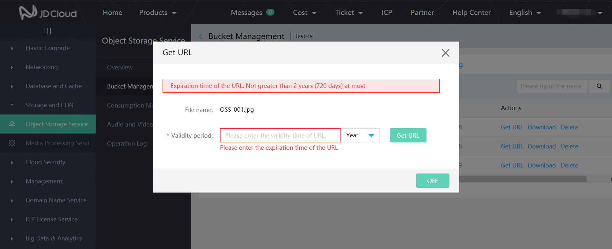

# Get object URL

You have uploaded files to the Bucket, and you can share and download the files through obtaining external link address of the uploaded files at any time according to the below action procedures:

1. Enter Object Storage Service console and then space management; click the bucket you need to access in the space list; after that, click **Object Management**.
2. Find the file of which you need to obtain the external link and click **Get URL** button.
3. If the access permission to current bucket is private read/write, the popup of Get External Link is as follows. You need to set a valid time of the external link. After the valid time is entered, click **Get External Link** to get an external link of this file:

Notes:

1. When the bucket has an access permission of "Private Read/Write", set a valid time for the file under the bucket; the external link address may be accessed at any time within the set valid time range; otherwise, the external link address may not be accessed.

2. When the bucket has a private permission, the address obtained is generated by URL signature.
