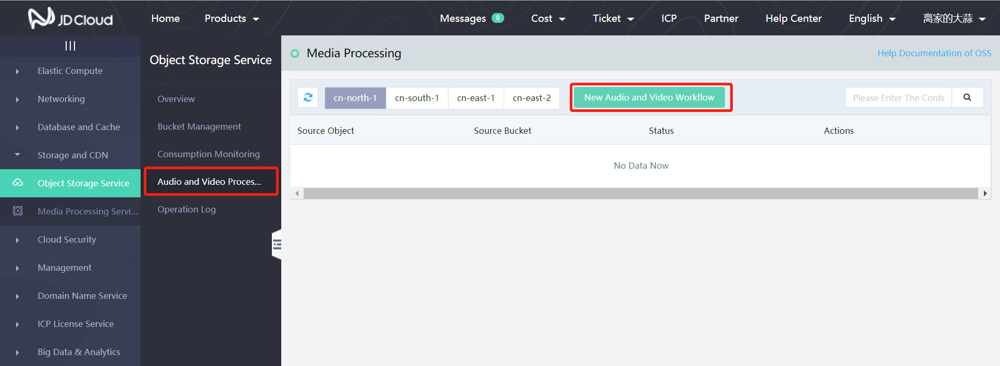
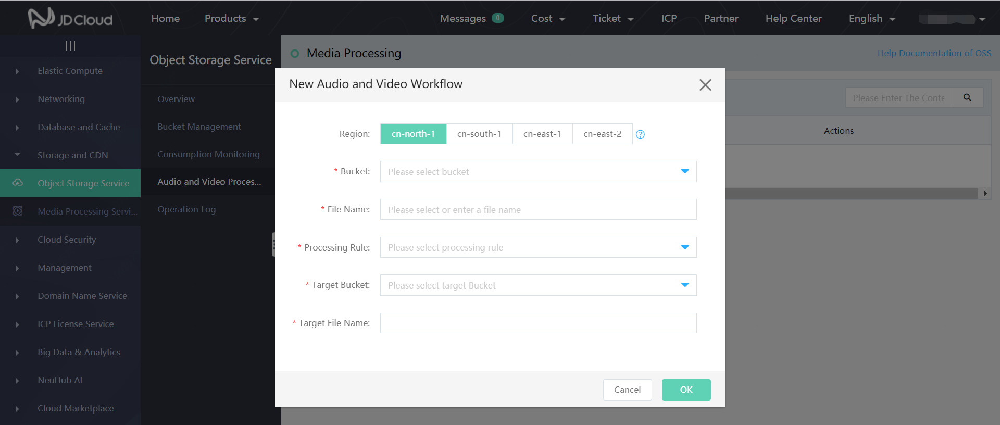

# Rapid Use of Audio and Video Processing

Object Storage Service provides the offline transcoding function of audio and video files. You may realize the processing of audio and video files by creating audio and video workflow according to the following action steps:

1. Log in Object Storage Service console, and click **Audio and Video Processing** in the left menu bar to enter the workflow list page of audio and video processing:

2. Click to create new audio and video workflow and input the parameters and processing rules of audio and video workflow; click **OK** when the input is completed:

Note: Input format supports most of the mainstream audio and video formats, such as mp4, flv, avi, rmvb, wmv, and hls, while output formats mainly support mp4, flv and hls.
