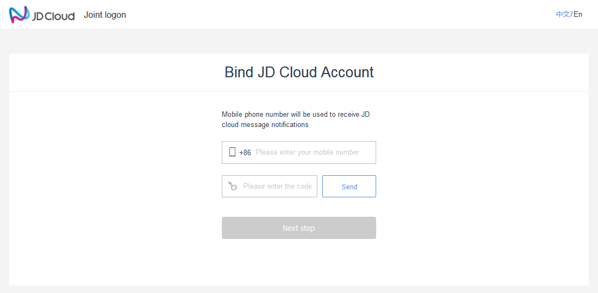

# Login and Registration
## Register an Account
The account registered at JD Cloud cannot be used for logging in JD Mall. Currently, JD Cloud only supports registration by the mainland mobile phone number, with the steps as follows:

### 1. Enter account name and password
The account name is the identifier of JD Cloud account for login. The page notifies for entry rules upon entering:
The length of the account name is 4-20 bits. Chinese characters, English letters, numbers or symbols of "-" and "_" can be entered. Account names in pure digital format are not supported;
The login password length is 7-20 bits. The password must contain English letters, numbers, and symbols (support for English symbols other than spaces), and the password must not be the same as the account name.

### 2. Enter a commonly used mobile phone number, as the security phone number of the account
Please use your regular mobile phone number for verification. The verification code may be sent by SMS or phone call. If the alternative mobile phone number is used for registration, because the network of secondary number is not stable, there may be problems of not receiving SMS or phone calls occasionally. Please wait for a while and try again later.

After successful registration, the phone number will become a security phone number associated to the account, used to receive important notifications from JD Cloud, and as a method of security verification of your account.
If your mobile phone number is used to subscribe JD Cloud service for the first time, the mobile phone number can be used for account login; if the mobile phone number has been associated with other JD Cloud Account, your mobile phone number cannot be used for login of the account you are currently registering.

### 3. Supplement Security Email
When the registration is completed, it will guide you to Email association, which can be skipped. Email is one of the main methods for JD Cloud to contact users. In order not to miss the change information, monitoring alarm, account information of JD Cloud resources and services, it is suggested to fill in and verify the Email.

After filling in, JD Cloud will send a verification Email to your mailbox. Please go to the mailbox and click the verification link as soon as possible to verify the Email. The validity of the verification link is 2 hours. If your Email is used to subscribe JD Cloud service for the first time, the Email can be used for account login after successful verification; if the mobile phone number has been associated with other JD Cloud Account, the Email can only be used for identity verification and message receiving, which cannot be used for login of the account you are currently registering.

## Login Accounts

### 1. Login by scanning code
Login by scanning code is the recommended login method. [JD Cloud App](https://console.jdcloud.com/download) is available in major application stores. After scanning the code, confirm the login on the mobile phone, and the computer can log in synchronously.

### 2. Login by entering account password
You can also login by entering account password.

If your phone or email is associated with a unique account on JD Cloud, you can also login using the phone or email with the password.
* If you receive "The phone/email cannot be used for login" message, it means that your account does not support logging in through the phone or email. Please try to enter the account name instead.
* If you have confirmed that you have successfully logged in to JD Cloud with this phone or email, you may belong to an old JD user. Please try the “JD Login” at the bottom of the page.

### 2. Login with JD
For users who use the JD account, please login from “JD login”. When you are not sure whether you should go to “JD Login”, please follow the instructions on the page.

### 3. Login with WeChat
You can also login to JD Cloud via WeChat account. If you selects to login via WeChat for PC, you need to scan the WeChat login QR code with your WeChat for mobile phone, and then agree on JD Cloud's use of WeChat login in the WeChat for mobile phone. JD Cloud will access your WeChat nickname for display on the page.

When you use the WeChat login for the first time, please associate the WeChat account with a JD Cloud account. When your mobile phone number is entered, the system will search the JD Cloud registered by you or automatically created a JD Cloud account for you.

If you have registered an account, you can select to associate with and login to this account.

If you are a new user, the system will automatically create an account for you. You can later view and manage the account in the "Account Management" center.

Under special circumstances, you will not be able to use the WeChat login because your JD Cloud account has been associated with another WeChat account or your account is a JD account, in which case, you can only login via JD; then please return to the login page and select **JD Login** — Only when the account is upgraded (view [JD Account Management](https://docs.jdcloud.com/cn/account-management/manage-jd-account) - for upgrading JD account to JD Cloud account), you can associate with the WeChat account and use WeChat login.

#### Disassociate WeChat account
When you no more need to use WeChat login, you can disassociate WeChat account on the page "Account Management - Basic Data". The precondition for disassociation is that a login password has been set for the current account and you can login by other means other than WeChat login.

If you haven't set a login password, you should set one too guarantee that the account can still be logged in by other means after the WeChat account is disassociated.
