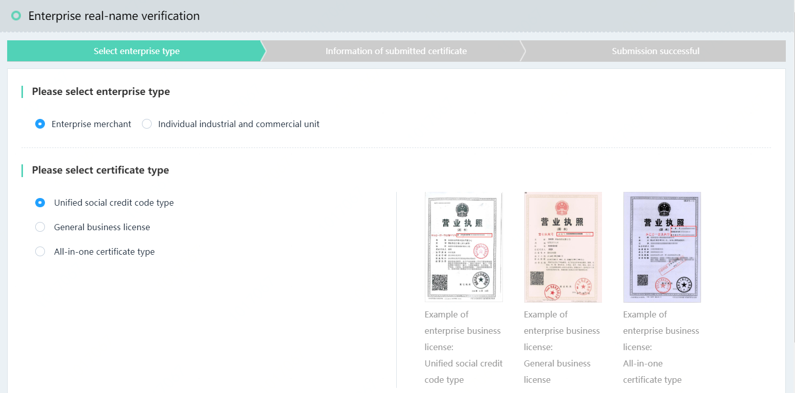
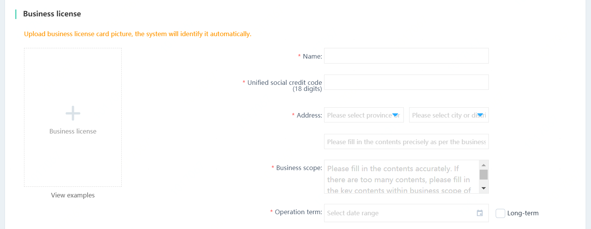
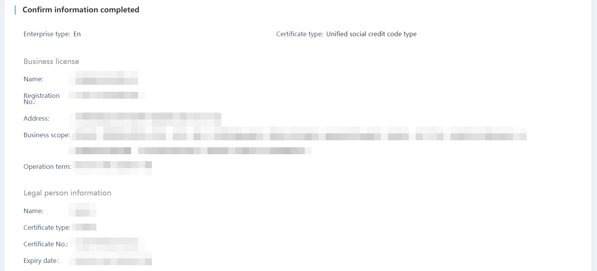
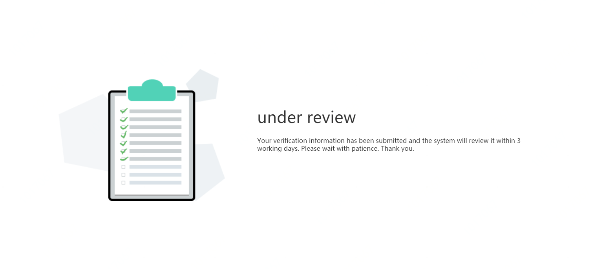
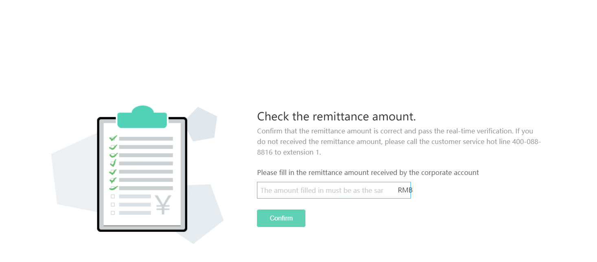
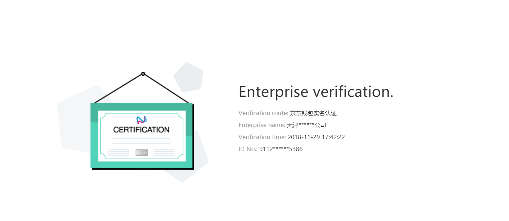

# Enterprise Real-name Verification Guideline

If you are an enterprise user, you can submit a real-name verification application directly in JD Cloud; and you can also log in JD Cloud > Account Management > Enterprise Real-name Verification > Synchronize Now after completion of real-name verification in JD Finance. For more details, please visit https://biz.jd.com > Business Center > JD Online Store User Login > Real-name Verification: Verify Now.

Enterprise real-name verification process: 1. Select the enterprise type  > 2. Select the business license certificate type  > 3. Submit the certificate information > 4. After successful submission, the enterprise verification information is to be reviewed > 5. Pass the information review > 6. Make successful payment to corporate account > 7. Pass the verification of the payment to corporate account

 1. Please select the organization type:
 (1) If the type of business license is a limited liability company, please select enterprise merchant;
 (2) If the type of business license is an individual business, please select individual business
 2. Please select the certificate type of business license:
 (1) The license has an 18-digit unified social credit code. Please select the unified social credit code entry for verification;
 (2) The license is a combination of three certificates. Please select the entry for all-in-one certificate (without independent organization code and taxation registration certificate) for verification;
 (3) If the license is a general license, please select the general business license (with an independent organization code and tax registration certificate) entry for verification.

 3. Submit certificate information

    - Fill in business license information
        - All uploaded photos must be clear and complete; be free of marks such as alterations or watermarks;
         - All photos or scanned copies of the original documents need not be stamped with the official seal of the enterprise, but the copies must be stamped with the red official seal of the enterprise;

    - Fill in the information about corporate account

    - Fill in the information about legal person certificates

    
    - Fill in the information about certificates of the authorized person
 
    
    - Fill in the power of attorney according to the template for power of attorney.
 
    
    - Preview the information about enterprise real-name verification, and send notification to the mobile and email to fill in. The passing of real-name verification data review and successful payment will be notified to your mobile phone and email by SMS or email.
 
 

 4. The submission is successful and the enterprise information is to be reviewed
  
 
 5. Information review is passed and the payment is to be made

 6. Payment to corporate account is successful and waiting for verification
  
 
 7. The payment to corporate account is verified.
  

Note: If the verification of the payment to corporate account amount fails for 5 consecutive times, and the real-name verification fails, the account will be frozen for 24 hours.
 
