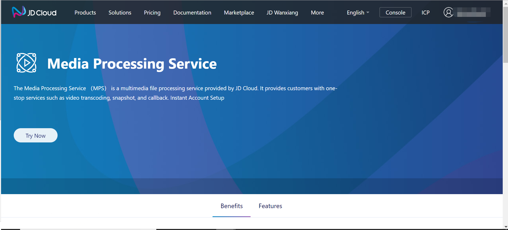

# Sign up Service

Operation Steps

1. Use the successfully registered JD Cloud account to login the homepage of Media Processing Service.

2. Click **Instant Account Setup**, and enter setup page.

3. Media Processing Service console can be used after the setup of JD Cloud Object Storage Service.
